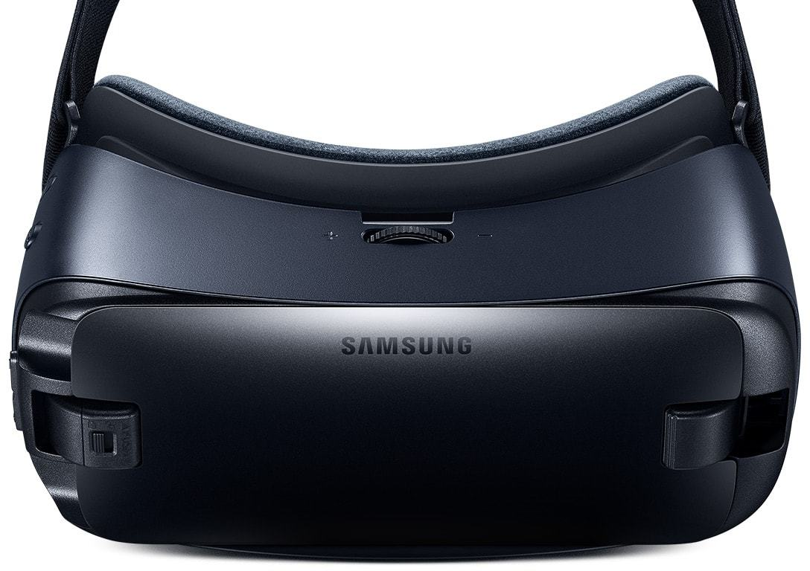
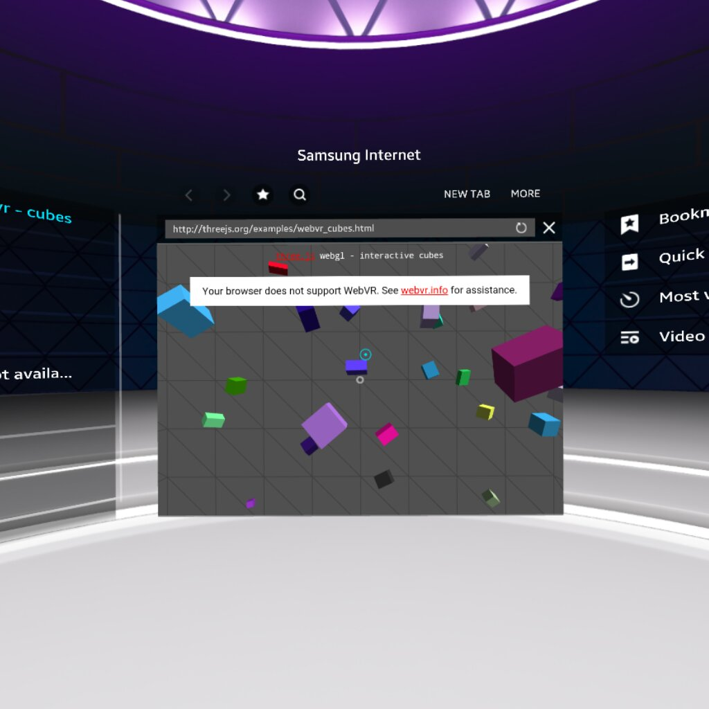

<script>
	window.iframeSlide = {
		setup: function () {
			var iframe = this.querySelector('iframe');
			iframe.src = iframe.dataset.src;
		},
		action: window.FakeGenerator([ function() {} ]),
		teardown: function () { this.querySelector('iframe').src = 'about:blank'; }
	};
	window.aSlidesSlideData = {};

	window.contentSlide = function (...slides) {
		var oldContent;

		return {
			setup() {
				oldContent = Array.from(this.children);
			},
			action: function* () {

				const t = slides.slice();

				if (t.length === 0) {
					yield;
					return;
				}

				while(t.length) {

					this.empty();
					let i = t.shift();
					if (i) {
						switch(Object.keys(i)[0]) {
							case 'video':
								this.innerHTML = `<video src="${i.video}" autoplay loop style="object-fit: contain; flex: 1 0;" />`;
								break;
							case 'image':
								this.innerHTML = `<image src="${i.image}" />`;
								break;
							case 'markdown':
								this.addMarkdown(i.markdown);
								break;
							case 'html':
								this.innerHTML = i.html;
								break;
							case 'iframe':
								this.innerHTML = `<iframe src="${i.iframe}" frameborder="none" style="flex: 1 0;" /></iframe>`;
								break;
						}
						if (i.caption) {
							this.addMarkdown(i.caption);
						}
						if (i.url  || i.iframe) {
							this.addHTML(`<div class="slide-url">${i.url || i.iframe || ''}</div>`);
						}
					}
					yield;
				}
			},
			teardown() {
				if (oldContent) {
					this.empty();
					oldContent.forEach(c => this.appendChild(c));
				}
			}
		};
	};
</script>

# Getting started with WebVR

<!-- Link to trigger conversion script -->
[Convert to Slide Deck](#aslides)

<span>Length should be <span id="a-frame-clock">45</span> minutes.</span>

Hi, I'm Ada from Samsung.

I am really irritating at dinner parties.

I am perpetually bringing out VR headsets and trying to put them on peoples' faces.

I love building and showing off cool VR demos and it's now easier than ever before.

My favourite moment is when I show someone a sick VR demo and they make this face:


<!-- This slide uses information from _config.yml -->
<blockquote class="dark" id="splash-slide" style="background-image: url('images/pattern.svg');">
<h1>{{ site.name }}</h1>
<h3>{{ site.description }}</h3>
<h2>{{site.author.name}} - {{site.author.company}}</h2>
</blockquote>

# Faces

I love that face.

My goal is to get you building stuff so you can wow people like this.

<script>window.aSlidesSlideData['slide-faces'] = window.contentSlide(
	{image: 'images/face1.jpg'},
	{image: 'images/face2.jpg'},
	{image: 'images/face3.jpg'},
	{image: 'images/face4.jpg'},
	{image: 'images/face5.jpg'}
);</script>
> 

# My love for vr

When I was a child this was my favourite TV show:

[Jonny Quest]

The characters would use virtual reality to travel to fully immersive worlds and have amazing adventures.

and the love of virtual reality has stayed with me ever since.

Through numerous scifi books

Movies

and Anime

What really stuck with VR is

the ability to step fully into another role.

to travel any where on this world

or off it

----------- Who has experienced VR before? -----------

---------- Who has their own VR heaset? --------------

It is an unreal experience, a good VR experience can transport you entirely, giving a feeling known as immersion.

** In this talk I aim to inspire you to produce VR content **

for the Web

even if you have never developed or worked with 3d before.

<script>window.aSlidesSlideData['slide-my-love-for-vr'] = window.contentSlide(
	{image: 'images/Jonny-Quest-the-real-adventures-of-jonny-quest.jpg'},
	{image: 'images/accelerando.jpg'},
	{image: 'images/neuromancer.jpg'},
	{image: 'images/matrix.gif'},
	{image: 'images/sao.jpg'},
	{image: 'images/market.jpg'},
	{image: 'images/iss.jpg'}
);</script>
> 


# Contents

> # Contents
>
> * Introduction

# Introduction

For those who haven't experienced VR yet. You can have a go on my Gear VR at the end.

What you get from VR as opposed to a computer monitor or TV screen is a feeling of immersion.

By placing your scene around your users they are engaged like never before.

They literally cannot look away.

A VR headset works by tracking your head rotation and position and showing to each eye what it would see in the virtual space.

> 

# Why VR and the web go hand in hand

The world wide web is the most prominent content delivery platform, it has unparalelled reach and grants us the ability to share and stream content.

Its network model allows us to enjoy multimedia experiences such as games and movies without downloading the whole thing.

The web can be enjoyed across a wide variety of platforms from phones to desktops and tvs.

URLs allow for linking and sharing content easily in a format familiar to the three and half billion people who use the internet.

VR for the web, known as WebVR, allows us to make the most of the Web's strongest powers to leverage 3D models, images, videos and audio to produce 3D worlds to immerse our readers in.

Recently the WebVR spec has become more mature. It can be used in Samsung's Internet Browser for the Gear VR. In addition scripts such as the `WebVR Polyfill` to allow you to use WebVR with Google Cardboard on other mobile browsers such as Chrome and Safari.

The proportion of people who access the internet on mobile devices is ever increasing and headsets can be just a piece of cardboard.

*Show Google Cardboard*

Cardboard devices are just cardboard and plastic lenses and are often cheap enough that newspapers will give them away. The FT did a give away recently.

<script>window.aSlidesSlideData['slide-why-vr-and-the-web-go-hand-in-hand'] = window.contentSlide(
	{image: 'images/MobileBroadbandInternetPenetrationWorldMap.svg', caption: 'Mobile Broadband Internet Saturation'},
	{image: 'images/cardboard.jpg'}
);</script>
> 


# Doing graphics in the Web

There are many tools and libaries for producing publishing graphics for the Web:

* Goo Create - Web bas
* Unity - Can be compiled for the Web
* Unreal - Can also be compiled for the Web
* THREE.js - JavaScript library for building scenes
* A-Frame - What I talk about here

> A non-exhaustive list:
>
> * Goo Create - Cool web based editor
> * Unity - Can compile for the Web
> * Unreal - Can also compile for the Web
> * THREE.js - JavaScript library for building scenes. Has a nice API.
> * A-Frame - What I talk about here.

# What is A-Frame

These are all really good solutions and if you are already familiar with one of these then don't feel pressured to change.

Why do I like A-Frame?

* A-Frame allows you to compose scenes with 3D models, Videos, Audio, Images by writing html.
* [MORE REASONS]


> 
>
> # https://aframe.io/

# Composing scenes with A-Frame

A-Frame is webby.

Well for one it looks like html and can be written directly into your markup.

It gives new html elements for building virtual reality

*Who here has built a website by typing out html before?*

It is much the same. Like HTML you can do an awful lot without writing a single line of javascript. But you can still use JavaScript to add extra functionality of you want.

It is also modular and extensible.

Modular means that I can write a component. For example. A component to give a heads up display or fancy lighting.

Then anyone can include it in their scenes without needing to write complex JavaScript.

It is extensible because my components will be based on other A-Frame components and you can release components that depend on mine.

You are not required to write a single line of JavaScript unless you want to make your own components.

> ```html
	<html>
		<head>
			<script src="js/a-frame.js"></script>
		</head>
		<body>
			<a-scene>
				<a-sphere position="0 1.25 -1" radius="1.25" color="#EF2D5E"></a-sphere>
				<a-cube position="-1 0.5 1" rotation="0 45 0" width="1" height="1" depth="1" color="#4CC3D9"></a-cube>
				<a-cylinder position="1 0.75 1" radius="0.5" height="1.5" color="#FFC65D"></a-cylinder>
				<a-plane rotation="-90 0 0" width="4" height="4" color="#7BC8A4"></a-plane>
				<a-sky color="#ECECEC"></a-sky>
			</a-scene>
		</body>
	</html>
```

# a-frame-basic-demo

This html from the previous slide gives us this.

But A-Frame gives us lots of hidden extras, all the basics to get started:

* The scene already has lighting
* It has a Camera
* That camera can be moved around by using the Arrow keys and clicking and dragging
* If you open it on your phone it is controlled by moving your phone
* It even has in built VR support, for both Cardboard devices and VR Headsets like the Samsung Gear VR

All of this functionality can be overridden if you don't like it or if you want more control.

<script>window.aSlidesSlideData['slide-a-frame-basic-demo'] = window.iframeSlide</script>

> <iframe src="basic.html" seamless="seamless"></iframe>
>
> ## {{ site.url }}/basic.html

The Gear VR does not run VR websites out of the box it needs to be turned on.

This is a bit annoying and confusing because my demos wouldn't work and I didn't know why.

> # Testing if WebVR is available
>
> 
>
> ## http://threejs.org/examples/webvr_cubes.html

Now your headset is set up to make the most of VR in the web!!!

Try that previous url again and you will see a cool demo, or try out any of the A-Frame demos.

Now we have WebVR set up lets actually build something.

> To enable webvr in GearVR open this URL in the WebVR browser
>
> # Picture of WebVR being enabled
>
> # internet://webvr-enable

# Actually building something

The first thing a lot of people build is a 360 degree photo/video Viewer.

It makes a great first project as it has very few components/

So we'll look at that first as it is a very simple demo.

<script>window.aSlidesSlideData['slide-actually-building-something'] = window.iframeSlide</script>

> <iframe src="360-simple.html" seamless="seamless"></iframe>
>
> ## {{ site.url }}/360-simple.html

Here I have some images I want to use.

These go into the a-assets tag, this tells a-frame to preload these for later.

We override the camera, by defining our own with the keyboard controls disabled. We don't want too let the user move around in the scene.

The final piece is the sky, the sky is an evenly lit inside out sphere. We give it the image we want to display and it shows it off.

This has all the features we want from a 360 image viewer, you can rotate the camera, view it immersively in vr and all in 7 lines of html

The image itself looks like this:

> ```html
<a-scene>
	<a-assets>
		
	</a-assets>
>
	<a-camera wasd-controls="enabled: false;"></a-camera>
>
	<a-sky src="#img1"></a-sky>
>
</a-scene>
```

The image itself looks like this:

> 

I took it with my 360 camera (no reason to post this I just think it is adorable):

> 

If you want to do something more advanced you can, you can use JavaScript to control a-frame just as normal.

Here I have written a small script to rotate through some images whenever I click.

> ```html
<a-scene>
	<a-assets>
		
		
		
	</a-assets>
>
	<a-camera wasd-controls="enabled: false;"></a-camera>
	<a-sky src="#img1"></a-sky>
>
</a-scene>
>
<script>
	var index = 0;
	var images = document.querySelectorAll('a-assets img');
	var sky = document.querySelector('a-sky');
	window.addEventListener('click', function () {
		index = (index + 1) % images.length;
		sky.setAttribute('src', '#' + images[index].id);
	});
</script>
```

# Demo 360 Slideshow

<script>window.aSlidesSlideData['slide-demo-360-slideshow'] = window.iframeSlide</script>

> <iframe src="360.html" seamless="seamless"></iframe>
>
> ## {{ site.url }}/360.html


# Introduce some tools for making 3d content

Enough showing you my holiday photos, what if you want to actually include a more complex 3D object:

A-Frame comes with a whole bunch of geometric primitives.

> * Box
> * Circle (One sided)
> * Cone
> * Cylinder Primitive
> * Plane
> * Ring
> * Sphere
> * Torus (A donut)
> * Torus Knot

But that is usually not enough there are a bunch of 3D modelling tools out there:

These all have a steep learning curve but if you are still in education you may have access to these through your school.

> * Maya (Expensive)
> * Z-Brush (Expensive, great for organics)
> * Cinema4D (Expensive)
> * Clara.io (Free, online)
> * Blender (Open Source, Difficult to use)

Because of the difficulty of making my own I tend to buy models from Turbo Squid.

3D assets come in many sizes some large for producing videos or still images. Or small for realtime work such as video games.

As we are making a real time game for mobile handsets we should keep required resources to a minimum.

> # 1000s of polygons
>
> # Around 10 of Megapixels of textures
>
> ## 'Game Ready' or 'Low Poly'

# Fancy Demo

If this seems like a low limit it is but there are many tricks we can employ to make the most of this.

This is a demo I produced for this talk.

<script>window.aSlidesSlideData['slide-fancy-demo'] = window.iframeSlide</script>

> <iframe src="track.html" seamless="seamless"></iframe>
>
> ## {{ site.url }}/track.html


# Resources

> # Resources
>
> https://developer.leapmotion.com/assets/Leap%20Motion%20VR%20Best%20Practices%20Guidelines.pdf
>
> https://developer.oculus.com/documentation/intro-vr/latest/concepts/bp_intro/
>
> https://iswebvrready.org
>
> WebVR Example: http://threejs.org/examples/webvr_cubes.html
>
> WebVR enable url: internet://webvr-enable
>
> https://github.com/aframevr/aframe-boilerplates

<script>
	var iframes = Array.from(document.querySelectorAll('iframe'));
	var blank = 'about:blank';
	iframes.forEach(function (iframe) {
		var button = document.createElement('button');
		var src = iframe.src;
		iframe.src = blank;
		iframe.dataset.src = src;
		button.addEventListener('click', function () {
			iframe.src = iframe.src === blank ? src : blank;
			if (iframe.src === blank) {
				button.classList.add('blank');
				button.textContent = "Load iFrame";
			} else {
				button.classList.remove('blank');
				button.textContent = "Unload iFrame";
			}
		});
		button.classList.add('iframe-button');
		button.classList.add('blank');
		button.textContent = "Load iFrame";
		iframe.after(button);
	});
</script>
