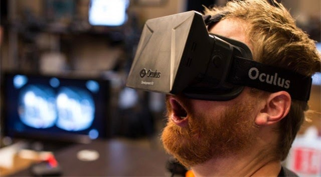
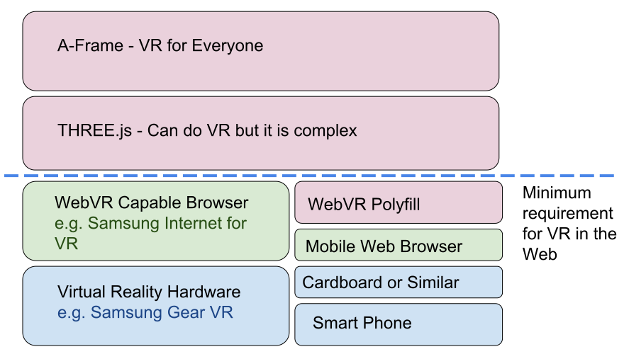

<script>
	window.iframeSlide = {
		setup: function () {
			var iframe = this.querySelector('iframe');
			iframe.src = iframe.dataset.src;
		},
		action: window.FakeGenerator([ function() {} ]),
		teardown: function () { this.querySelector('iframe').src = 'about:blank'; }
	};
	window.aSlidesSlideData = {};

	window.playVideo = {
		setup: function () {
			this.querySelector('video').play();
		},
		action: window.FakeGenerator([ function() {} ]),
		teardown: function () { }
	}

	window.contentSlide = function (...slides) {
		var oldContent;

		return {
			setup() {
				oldContent = Array.from(this.children);
			},
			action: function* () {

				const t = slides.slice();

				if (t.length === 0) {
					yield;
					return;
				}

				while(t.length) {

					this.empty();
					let i = t.shift();
					if (i) {
						switch(Object.keys(i)[0]) {
							case 'video':
								this.innerHTML = `<video src="${i.video}" preload autoplay autostart loop style="object-fit: contain; flex: 1 0;" />`;
								break;
							case 'image':
								this.innerHTML = `<image src="${i.image}" />`;
								break;
							case 'markdown':
								this.addMarkdown(i.markdown);
								break;
							case 'html':
								this.innerHTML = i.html;
								break;
							case 'iframe':
								this.innerHTML = `<iframe src="${i.iframe}" frameborder="none" style="flex: 1 0;" /></iframe>`;
								break;
						}
						if (i.caption) {
							this.addMarkdown(i.caption);
						}
						if (i.url  || i.iframe) {
							this.addHTML(`<div class="slide-url">${i.url || i.iframe || ''}</div>`);
						}
					}
					yield;
				}
			},
			teardown() {
				if (oldContent) {
					this.empty();
					oldContent.forEach(c => this.appendChild(c));
				}
			}
		};
	};
</script>

# Getting started with WebVR

<!-- Link to trigger conversion script -->
[Convert to Slide Deck](#aslides)

<span>Length should be <span id="a-frame-clock">45</span> minutes.</span>

Hi, I'm Ada from Samsung.

I am really irritating at dinner parties.

I am perpetually bringing out VR headsets and trying to get people to have a go.

I love building and showing off cool VR demos.

Now it is now easier than ever before.

When they do give it a go though

my favourite moment is when they get wowed by the immersion and they make this face:


<!-- This slide uses information from _config.yml -->
<blockquote class="dark" id="splash-slide" style="background-image: url('images/pattern.svg');">
<h1>{{ site.name }}</h1>
<h3>{{ site.description }}</h3>
<h2>{{site.author.name}} - {{site.author.company}}</h2>
</blockquote>

# Faces

I love that face.

My goal is to get you building stuff

so you can make your friends and relatives have the same

awed expression

<script>window.aSlidesSlideData['slide-faces'] = window.contentSlide(
	{image: 'images/face1.jpg'},
	{image: 'images/face2.jpg'},
	{image: 'images/face3.jpg'},
	{image: 'images/face4.jpg'},
	{image: 'images/face5.jpg'}
);</script>
> 

# My love for vr

When I was a child this was my favourite TV show:

[Jonny Quest]

The characters would use virtual reality to travel to fully immersive worlds and have amazing adventures.

and the love of virtual reality has stayed with me ever since.

Through numerous scifi books

Movies

and Anime

For me what really mesmerised me with VR is

the ability to step fully into another role.

someone elses shoes

to travel any where on this world

or off it

<script>window.aSlidesSlideData['slide-my-love-for-vr'] = window.contentSlide(
	{image: 'images/Jonny-Quest-the-real-adventures-of-jonny-quest.jpg'},
	{image: 'images/accelerando.jpg'},
	{image: 'images/neuromancer.jpg'},
	{image: 'images/matrix.gif'},
	{image: 'images/sao.jpg'},
	{image: 'images/market.jpg'},
	{image: 'images/iss.jpg'}
);</script>
> 

# Introduction

----------- Who has experienced VR before? -----------

---------- Who has their own VR heaset? --------------

It is an unreal experience, a good VR experience can transport you entirely, giving a feeling known as immersion.

I have always dreamed of a unified VR world full of experiences we can just step into.

** In this talk I aim to inspire you to produce VR content **

for the Web

even if you have never developed or worked with 3d before.

For those who haven't experienced VR yet. You can have a go on my Gear VR at the end.

What you get from VR as opposed to a computer monitor or TV screen is a feeling of immersion.

By placing your scene around your users they are engaged like never before.

They literally cannot look away.

A VR headset works by tracking your head rotation and position and showing to each eye what it would see in the virtual space.

> 


# Contents

This is what I aim to cover in this talk:

> * Why Virtual Reality and the Web Go Hand in Hand
> * What is A-Frame, how does it allow us to do Virtual Reality
> * A-Frame Hello World, our first 3D scene.
> * Activating VR on Gear VR
> * Making something useful, a 360 image viewer
> * Adding some interactivity
> * Using more complex shapes and game assets
> * Inventing new VR user interfaces
> * Some interesting experiments
> * What I am building and final thoughts
> * Questions

# Why VR and the web go hand in hand

The world wide web is the most prominent content delivery platform, it has unparalelled reach and grants us the ability to share and stream content.

Its network model allows us to enjoy multimedia experiences such as games and movies without downloading the whole thing.

The web can be enjoyed across a wide variety of platforms from phones to desktops and tvs.

URLs allow for linking and sharing content easily in a format familiar to the three and half billion people who use the internet.

VR for the web, known as WebVR, allows us to make the most of the Web's strongest powers to leverage 3D models, images, videos and audio to produce 3D worlds to immerse our readers in.

Recently the WebVR spec has become more mature. It can be used in Samsung's Internet Browser for the Gear VR. In addition scripts such as the `WebVR Polyfill` to allow you to use WebVR with Google Cardboard on other mobile browsers such as Chrome and Safari.

The proportion of people who access the internet on mobile devices is ever increasing and headsets can be just a piece of cardboard.

*Show Google Cardboard*

Cardboard devices are just cardboard and plastic lenses and are often cheap enough that newspapers will give them away. The FT did a give away recently.

<script>window.aSlidesSlideData['slide-why-vr-and-the-web-go-hand-in-hand'] = window.contentSlide(
	{image: 'images/MobileBroadbandInternetPenetrationWorldMap.svg', caption: '## Mobile Broadband Internet Saturation'},
	{image: 'images/cardboard.jpg'}
);</script>
> 


# Doing 3D graphics in the Web

There are many tools and libaries for producing publishing 3D graphics for the Web:

* Goo Create - Web based
* Unity - Can be made to build 3D scenes for the Web
* Unreal Engine - Can also be compiled to run the Web
* THREE.js - JavaScript library for building 3D scenes in the Web. Is nice to program in.
* A-Frame - What I talk about here, built on THREE.js, allows us to make 3D scenes the same way we would make a HTML document.

These are all really good solutions and if you are already familiar with one of these then don't feel pressured to change.

> ## A non-exhaustive list:
>
> * Goo Create - Web based
> * Unity - Can be made to build 3D scenes for the Web
> * Unreal Engine - Can also be compiled to run the Web
> * THREE.js - JavaScript library for building 3D scenes in the Web. Is nice to program in.
> * A-Frame - What I talk about here, built on top of THREE.js.

# What is A-Frame

A-Frame a is a JavaScript library to abstract away the difficult and the rote parts of Virtual Reality.

A-Frame is built on top of another library called THREE.js

It also includes the WebVR polyfill.

The WebVR polyfill allows all smartphones to be VR capable with Google Cardboard

THREE.js provides a nice way to work with 3D rendering.

A-Frame simplifies everything and abstracts away the more difficult bits.

Allowing us to get started straight away!

> 

Why do I like A-Frame?

A-Frame allows you to compose scenes with 3D models, Videos, Audio, Images by writing html.

It handles a lot of the heavy lifting and edge cases.

The fundamentals of a scene are already set up so don't need to be written out again and again and again

I can get started making something straight away with no faffing about.

> 
>
> # https://aframe.io/

# Composing scenes with A-Frame

A-Frame is webby.

Well for one it looks like html and can be written directly into your markup.

It gives new html elements for building virtual reality

*Who here has built a website by typing out html before?*

It is much the same. Like HTML you can do an awful lot without writing a single line of javascript. But you can still use JavaScript to add extra functionality of you want.

It is also modular and extensible.

Modular means that I can write a component. For example. A component to give a heads up display or fancy lighting.

Then anyone can include it in their scenes without needing to write complex JavaScript.

It is extensible because my components will be based on other A-Frame components and you can release components that depend on mine.

You are not required to write a single line of JavaScript unless you want to make your own components.

* Walk through this line by line *

> ```html
	<html>
	<head>
		<script src="js/a-frame.js"></script>
	</head>
	<body>
		<a-scene>
			<a-sphere position="0 1.25 -1" radius="1.25" color="#EF2D5E"></a-sphere>
			<a-box position="-1 0.5 1" rotation="0 45 0" color="#4CC3D9"></a-box>
			<a-cylinder position="1 0.75 1" radius="0.5" color="#FFC65D"></a-cylinder>
			<a-plane rotation="-90 0 0" width="4" height="4" color="#7BC8A4"></a-plane>
			<a-sky color="#ECECEC"></a-sky>
		</a-scene>
	</body>
	</html>
```

# a-frame-basic-demo

This html from the previous slide gives us this.

But A-Frame gives us lots of hidden extras, all the basics to get started:

* The scene already has lighting
* It has a Camera
* That camera can be moved around by using the Arrow keys and clicking and dragging
* If you open it on your phone it is controlled by moving your phone
* It even has in built VR support, for both Cardboard devices and VR Headsets like the Samsung Gear VR

All of this functionality can be overridden if you don't like it or if you want more control.

<script>window.aSlidesSlideData['slide-a-frame-basic-demo'] = window.iframeSlide</script>

> <iframe src="basic.html" seamless="seamless"></iframe>
>
> ## {{ site.url }}/basic.html

The Gear VR does not run VR websites out of the box it needs to be turned on.

This is a bit annoying and confusing because my demos wouldn't work and I didn't know why.


<blockquote class="dark" style="background-image: url('images/nowebvr.jpg');">
	<h1>Testing if WebVR is available</h1>
	<p><br />&nbsp;</p>
	<h1>http://threejs.org/examples/webvr_cubes.html</h1>
</blockquote>

Now your headset is set up to make the most of VR in the web!!!

Try that previous url again and you will see a cool demo, or try out any of the A-Frame demos.

Now we have WebVR set up lets actually build something.


<blockquote class="dark" style="background-image: url('images/webvr-enable.jpg');">
	<h2>To enable webvr in GearVR open this URL in the WebVR browser</h2>
	<p><br />&nbsp;</p>
	<h1>internet://webvr-enable</h1>
</blockquote>

# Actually building something

The first thing a lot of people build is a 360 degree photo/video Viewer.

It makes a great first project as it has very few components/

So we'll look at that first as it is a very simple demo.

<script>window.aSlidesSlideData['slide-actually-building-something'] = window.iframeSlide</script>

> <iframe src="360-simple.html" seamless="seamless"></iframe>
>
> ## {{ site.url }}/360-simple.html

Here I have some images I want to use.

These go into the a-assets tag, this tells a-frame to preload these for later.

We override the camera, by defining our own with the keyboard controls disabled. We don't want too let the user move around in the scene.

The final piece is the sky, the sky is an evenly lit inside out sphere. We give it the image we want to display and it shows it off.

This has all the features we want from a 360 image viewer, you can rotate the camera, view it immersively in vr and all in 7 lines of html

The image itself looks like this:

> ```html
<a-scene>
	<a-assets>
		
	</a-assets>
>
	<a-camera wasd-controls="enabled: false;"></a-camera>
>
	<a-sky src="#img1"></a-sky>
>
</a-scene>
```

The image itself looks like this:

> 

I took it with my 360 camera (no reason to post this I just think it is adorable):

> 

# Adding some interactivity

If you are comfortable writing JavaScript and want to do something more advanced

You can, you can use JavaScript to control a-frame just like you would use it on normal html

Here I have written a small script to rotate through some images whenever I click.

> ```html
<a-scene>
	<a-assets>
		
		
		
	</a-assets>
>
	<a-camera wasd-controls="enabled: false;"></a-camera>
	<a-sky src="#img1"></a-sky>
>
</a-scene>
>
<script>
	var index = 0;
	var images = document.querySelectorAll('a-assets img');
	var sky = document.querySelector('a-sky');
	window.addEventListener('click', function () {
		index = (index + 1) % images.length;
		sky.setAttribute('src', '#' + images[index].id);
	});
</script>
```

# Demo 360 Slideshow

<script>window.aSlidesSlideData['slide-demo-360-slideshow'] = window.iframeSlide</script>

> <iframe src="360.html" seamless="seamless"></iframe>
>
> ## {{ site.url }}/360.html


# Introduce some tools for making 3d content

Enough showing you my holiday photos, what if you want to actually include a more complex 3D object:

A-Frame comes with a whole bunch of geometric primitives.

By one sided I mean that if you were to view it from the back you don't see anything.

> * Box
> * Circle (One sided)
> * Cone
> * Cylinder Primitive
> * Plane (One sided)
> * Ring
> * Sphere
> * Torus (A donut)
> * Torus Knot

# One Sided

In 3D unless specified otherwise flat shapes are one sided

By one sided I mean that if you were to view it from the back you don't see anything.

But there is only so much you can do with primitives.

We can make them a little more complex by attatching them together.

<script>window.aSlidesSlideData['slide-one-sided'] = window.iframeSlide</script>

> <iframe src="one-sided.html" seamless="seamless"></iframe>
>
> ## {{ site.url }}/one-sided.html

# Models from Primitives

By making one object a child of another they become attached together.

The child is transformed in the same way as the parent.

By transformed I mean the way it is scaled, rotated or positioned.

This keeps them stuck together.

<script>window.aSlidesSlideData['slide-models-from-primitives'] = window.iframeSlide</script>

> ```html
	<a-box position="0 2 0" color="red">
>
		<!-- This blue box is a child of the red box -->
		<a-box position = "0.5 0.5 0.5" color="blue"></a-box>
>
		<!-- Spin the red box -->
		<a-animation repeat="indefinite" attribute="rotation" easing="linear" to="0 360 0" dur="2000"></a-animation>
	</a-box>
```
> <iframe src="two-boxes.html" seamless="seamless"></iframe>

# Scene Graphs

This behaviour is known as a scene graphs

It creates a heirarchy of items in the scene. So you can reuse models and attach them to other objects.

E.g. A model bus only needs one chair which can then be reused and attatched to the bus again and again.

This is good because each model is expensive but reusing it is cheap.

The example behind me is just a more elaborate version of the last slide.

* The eyes are children of the head
* Which is a child of the body
* Which is a child of the robot

It is being transformed elaborately

* The robot is being shrunk and grown
* the head is being rotated
* Through all this the eyes stay in place

<script>window.aSlidesSlideData['slide-scene-graphs'] = window.iframeSlide</script>

> <iframe src="scene-graph.html" seamless="seamless"></iframe>
>
> ## {{ site.url }}/scene-graph.html

# Getting Models

But that is still usually not enough we want custom models.

You can make your own or buy them.

there are a bunch of 3D modelling tools out there:

These all have a steep learning curve but if you are still in education you may have access to these through your school.

> * Maya (Expensive)
> * Z-Brush (Expensive, great for organics)
> * Cinema4D (Expensive)
> * Clara.io (Free, online)
> * Blender (Open Source, Difficult to use)

Because of the difficulty of making my own I tend to buy models from Turbo Squid.

3D assets come in many sizes some large for producing videos or still images. Or small for realtime work such as video games.

As we are making a real time game for mobile handsets we should keep required resources to a minimum.

> # 'Game Ready' or 'Low Poly'
>
> ## In total a scene should contain no more than:
>
> ## 1000s of polygons
>
> ## Around 10 of Megapixels of textures


# Including Custom Models

I found this model on turbosquid, I want to use it for a game.

It has 889 polygons and a 1024x1024 texture that looks pretty good to me.

I changed the texture from a bitmap to a jpeg to make it faster to download.

It is available in OBJ format, one of the formats that can be imported into A-Frame

In this example it was really big and facing the wrong direction so I shrunk it and rotated it to place it in front of the camera.

<script>window.aSlidesSlideData['slide-including-custom-models'] = window.contentSlide(
	{image: 'images/turbosquid.png'},
	{markdown: `
* .OBJ - OBJ format just does geometry and textures
* .DAE - Collada can include animations, character skeletons, lighting,... lots of things.
`},
{markdown: '```' + `
<a-scene>
	<a-assets>
		<a-asset-item id="obj" src="Feisar_Ship.obj"></a-asset-item>
		<a-asset-item id="mtl" src="Feisar_Ship.mtl"></a-asset-item>
	</a-assets>

	<a-obj-model src="#obj" mtl="#mtl" id="ship"></a-obj-model>
</a-scene>
` + '```'
},{
	iframe: 'obj.html'
})</script>

> 

# Making new components

There is a lot to take in when learning A-Frame for the first time.

I was totally lost.

I reached out to A-Frame community by joining the A-Frame slack channel.

They are really friendly and very helpful.

I asked where to begin and some of the best advice I recieved was to create your own component.

This seemed daunting at first but once I got stuck in and asked for some help it began to make sense.

This really allowed me to get to grips with how A-Frame works.


> 
>
> ## https://aframe.io/community/


# What can Components do?

Components are the discreet bits of logic which power A-Frame.

Each attribute on the html elements we write is a component.

For example the position component just sets the objects position in 3D space.

They are usually totally agnostic to what they get attatched to.

For example we can take the 'wasd-controls' off the camera and attach them to our racing ship from earlier.

> ```html
<a-scene>
>
	<!-- controls  disabled -->
	<a-camera wasd-controls="enabled: false;"></a-camera>
>
>
	<!-- controls  enabled -->
	<a-entity wasd-controls="enabled: true;">
		<a-obj-model src="#Feisar-ship-obj" mtl="#Feisar-ship-mtl" id="ship"></a-obj-model>
	</a-entity>
>
</a-scene>
```

# Component move demo

As you can see now the camera does not move but the ship does

I'm beginning to think we could do something cool with this...

<script>window.aSlidesSlideData['slide-component-move-demo'] = window.iframeSlide</script>

> <iframe src="moving-the-wasd-controller.html" seamless="seamless"></iframe>
>
> ## {{ site.url }}/moving-the-wasd-controller.html

# Other projects and User Interfaces

The really interesting state we are in now is that we are in a green field of interface design.

Nothing is set in stone.

Interactions tend to fall somewhere on this graph.

Building interactions in the top right is where most people jump to.

Although familiar and quick to be grasped they limit what could be done to what is already doable.

Interactions in the top left square can be quirky and fun because they subvert are expectations of reality.

The bottom right tend to be more minimalist, they make sense when that interaction is not something which needs to be special. This kind of interface is probably familiar to those used to playing first person roleplaying games.

Click on this, click on that. Simple potentially restrictive.

The bottom left square is where the VR magic will happen. Unconstrained by both reality and pre-existing assumptions and expectations a new User interface language will be formed.

Thinking of icons we are familiar with

* E.g. Hamburger icon would sit in the bottom left
* Save icon is top right if you are born in the 80s
* Or bottom right if you were born in the 90s 00s

A new generation has grown up where every screen is a touch screen

Who are familiar with the visual language of those screens.

We designing user interfaces for the VR generation.

VR gives us new tools for design

A sense of scale, we can build interfaces at a familiar scale to the user or with no extra work make them tiny or huge.

Things can be relateable or familiar but behave by different rules.

VR can be at once both familiar and Surreal,

> 

People get used to new interactions really quickly.

Minesweeper was invented to teach people to use right click.

As we settle on new design languages for VR people are going to need a similar step up

> 

# My Faves

Over the past year I have seen some really interesting user interface elements in VR.

These are a few of my faves. The a forementioned exit burrito.

* Juicy Sliders
* Exit Burrito
* Going through links by putting something on your head

<script>window.aSlidesSlideData['slide-my-faves'] = window.contentSlide({
	video: 'images/juicy-sliders.mp4',
	caption: '## https://twitter.com/Cabbibo/status/758792984095621120'
},{
	video: 'images/exit-burrito.mp4',
	caption: '## Owlchemy Labs’ Job Simulator 2050'
},{
	video: 'images/a-frame-link-traversal.mp4',
	caption: '## Link traversal in the next release of A-Frame'
}
)</script>

> <video src="images/juicy-sliders.mp4" muted preload autoplay autostart loop></video>

# A-Frame Examples

That last one I found on the A-Frame blog.

Each week A-Frame do a blog post highlighting development of the platform and interesting projects from the community.

Check it out really interesting and exciting to see what is upcoming in A-Frame.

Also the wide variety of demos and projects are great if you are stumped for ideas

> 
>
> ## https://aframe.io/blog/

# Google's Daydream Experiments

Google are regularly giving feedback from their experiments into VR interaction

<script>window.aSlidesSlideData['slide-google-s-daydream-experiments'] = window.playVideo</script>

> # Google's Daydream Experiments
>
> <video src="images/simpleavatars.mp4" muted autoplay autostart loop preload></video>
>
> ## http://uploadvr.com/google-shares-lessons-60-vr-experiments/

# Google VR Videos

They have lots of examples on their website

This recent one is interesting, an experiment in diffusing situations where one player might get irate by reducing their agency if not playing nice.

<script>window.aSlidesSlideData['slide-google-vr-videos'] = window.iframeSlide</script>

> <iframe width="560" height="315" src="https://www.youtube.com/embed/BoOVVx9CnL8" frameborder="0" allowfullscreen></iframe>
>
> ## https://www.youtube.com/channel/UCkUZagbGbewp3bZQLXGzkmA

# Some rules for what you should not do

* Don't teleport the user it will just confuse them.
* Don't accelerate or rotate the camera unless in well expected smooth fashion, you will make them seasick.
* Don't do something which runs laggy, it may make them ill.

# Stuff you should

* Do have interactive elements give a wiggle when the user glances at it.
* Do make any text large, thick and clear
* Do have fun making something

Some guides to building good expereinces:

My slides are online if you want to find this later

> ### https://developer.leapmotion.com/assets/ Leap%20Motion%20VR%20Best%20Practices%20Guidelines.pdf
>
> ## https://developer.oculus.com/documentation/intro-vr/latest/concepts/bp_intro/

# Fancy Demo and Conculsion

I started playing with A-Frame a week ago, all of the demos in this slide deck I built yesterday.

This final demo is a litle on going project where I am experimenting with what can be done with a-frame.

There are many ways I would take this forward

I would like to add audio with the sound component to give engine noise to my ship and background music to the game in general.

I would like to take advantage of the Webs peer to peer networking capabilities to add multiplayer

I would like to add an elevated track which uses a physics engine to handle jumps and crashes.

This is all stuff you can do with A-Frame, it gets easier and easier as the community grows and we use each others components.

We will stand on the shoulders of giants and together we build great things.

Btw if you build something cool, send it to me.

<script>window.aSlidesSlideData['slide-fancy-demo-and-conculsion'] = window.iframeSlide</script>

> <iframe src="track.html" seamless="seamless"></iframe>
>
> ## {{ site.url }}/track.html

# The future?

I would like to finish up with this youtube video. By Boris Smus who has done a lot of work towards WebVR.

It is a demo he put out yesterday of co-presence in the browser making the most of web technology.

<script>window.aSlidesSlideData['slide-the-future-'] = window.iframeSlide</script>

> <iframe src="https://www.youtube.com/embed/FPJDNQJt2DQ?start=26" frameborder="0" allowfullscreen></iframe>

# Resources

> # Resources
>
> https://developer.leapmotion.com/assets/Leap%20Motion%20VR%20Best%20Practices%20Guidelines.pdf
>
> https://developer.oculus.com/documentation/intro-vr/latest/concepts/bp_intro/
>
> https://iswebvrready.org
>
> WebVR Example: http://threejs.org/examples/webvr_cubes.html
>
> WebVR enable url: internet://webvr-enable
>
> https://github.com/aframevr/aframe-boilerplates
>
> A-Frame Blog loads of fun examples - https://aframe.io/blog/
>
> A-Frame slack channel https://aframevr-slack.herokuapp.com/
>
> Images of people wearing HMDs - http://mashable.com/2015/06/18/vr-face/

<script>
	var iframes = Array.from(document.querySelectorAll('iframe'));
	var blank = 'about:blank';
	iframes.forEach(function (iframe) {
		var button = document.createElement('button');
		var src = iframe.src;
		iframe.src = blank;
		iframe.dataset.src = src;
		button.addEventListener('click', function () {
			iframe.src = iframe.src === blank ? src : blank;
			if (iframe.src === blank) {
				button.classList.add('blank');
				button.textContent = "Load iFrame";
			} else {
				button.classList.remove('blank');
				button.textContent = "Unload iFrame";
			}
		});
		button.classList.add('iframe-button');
		button.classList.add('blank');
		button.textContent = "Load iFrame";
		iframe.after(button);
	});
</script>