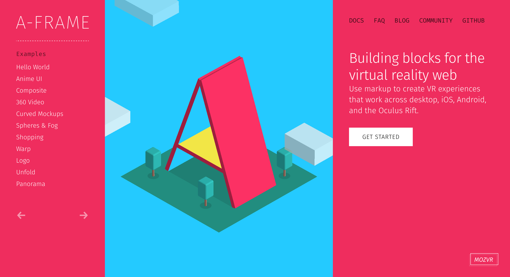

<script>
var captionStyle = 'z-index: 2; text-align: center; background: rgba(0,0,0,0.8); padding: 1em; border-radius: 1em; width: auto; margin: 1em; font-size: 3rem; margin-top: -3em;';
</script>

# {{page.title}}

<!-- Link to trigger conversion script -->
[Convert to Slide Deck](#aslides)

Length: 45 minutes


<blockquote class="dark" style="background-color: #576363 !important; background-image: url(images/me-and-dan.jpg);background-size: cover;min-height: 16em;display: flex;justify-content: flex-start;padding: 0.5em;background-position: center right;align-items: stretch;">
<span style="flex-grow: 1;text-align: right; font-size: 4rem; text-shadow: 0 0 1em #576363;">@lady_ada_king</span>
<span style="font-size: 5rem; text-shadow: 0 0 1em #576363;">@samsunginternet</span>
</blockquote>

<blockquote style="background-color: white;">

</blockquote>

<blockquote>

</blockquote>

<script>window._setNextSlide(window.videoSlide);</script>
<blockquote style="padding: 0; justify-content: flex-end;">
<video src="images/space-jam.mp4" style="position:absolute; top: 0; left: 0; width:100%; height: 100%; max-height: none; object-fit: cover;"></video>
</blockquote>

<script>window._setNextSlide(window.videoSlide);</script>
<blockquote style="padding: 0; justify-content: flex-end;">
<video src="images/360-media.mp4" style="position:absolute; top: 0; left: 0; width:100%; height: 100%; max-height: none; object-fit: cover;"></video>
</blockquote>

<script>window._setNextSlide(elByEl({
	preserve: 'h1:first-child'
}))</script>
> # Building immersive media into the web platform
>
> ## Set the environment
>
> ```javascript
// First, check if the API is available
if ('SamsungChangeSky' in window) {
  // Set the spherical panorama image
  window.SamsungChangeSky({ sphere: 'http://site.com/panorama.jpg' });
}
```
>
> ## Immersive Video
> <pre class="highlight"><code><span class="nt">&lt;video</span> <span class="na">src=</span><span class="s">"/360.webm"</span> <span class="na">type=</span><span class="s">"video/webm; dimension=360-lr;"</span><span class="nt">&gt;&lt;/video&gt;</span>
</code></pre>


<script>window._setNextSlide(window.videoSlide);</script>
<blockquote style="padding: 0; justify-content: flex-end;">
<video src="images/enter-vr.mp4" style="position:absolute; top: 0; left: 0; width:100%; height: 100%; max-height: none; object-fit: cover;"></video>
</blockquote>


# History

<script>window._setNextSlide({
	setup: function () {
		this._img = this._img || this.querySelector('img');
		this._shadeAfter = this._shadeAfter || this.querySelector('.shade-after');
		_applyCSS(this._shadeAfter, {
			opacity: 1
		});
		_applyCSS(this._img, {
			transition: 'transform 1s ease',
			maxHeight: 'none',
			height: '100%',
			flexShrink: '0',
			margin: 0,
			filter: 'invert(1)'
		});
		this._img.style.transform = 'translateY(50vh) translateY(-1.5rem) translateY(-3.5%)';
	},
	action: function *() {
		this._img.style.transform = 'translateY(50vh) translateY(-1.5rem) translateY(-3.5%)';
		yield;
		this._img.style.transform = 'translateY(50vh) translateY(-1.5rem) translateY(-13.5%)';
		yield;
		this._img.style.transform = 'translateY(50vh) translateY(-1.5rem) translateY(-25%)';
		yield;
		this._img.style.transform = 'translateY(50vh) translateY(-1.5rem) translateY(-38%)';
		yield;
		this._img.style.transform = 'translateY(50vh) translateY(-1.5rem) translateY(-45%)';
		yield;
		this._img.style.transform = 'translateY(50vh) translateY(-1.5rem) translateY(-57%)';
		yield;
		this._img.style.transform = 'translateY(50vh) translateY(-1.5rem) translateY(-70%)';
		yield;
		this._img.style.transform = 'translateY(50vh) translateY(-1.5rem) translateY(-83%)';
		yield;
		this._shadeAfter.style.opacity = 0;
		this._img.style.transform = 'translateY(50vh) translateY(-1.5rem) translateY(-92%)';
		yield;
	},
	teardown () {
		if (!this._img) return;
		this._img.setAttribute('style', '');
		this._shadeAfter.setAttribute('style', '');
	}
});</script>
> <div class="shade-before"></div><div style="position: absolute; left: 0; top:0; right: 0;"></div><div class="shade-after"></div>


## Render loop

> 

## Head Tracking Demo

<script>window._setNextSlide(window.videoSlide);</script>
<blockquote style="padding: 0; justify-content: flex-end; background-color: black !important;">
<video src="images/tracking.m4v" style="position:absolute; top: 0; left: 0; width:100%; height: 100%; max-height: none; object-fit: contain;"></video>
</blockquote>

# Where is it supported

> 

A-Frame is a Mozilla project for building VR using HTML

It really made me a beleiver in declarative VR is a good and possible future for the Web.

By abstracting away a bunch of details

I am introducing the A-Frame project.

A-Frame uses custom elements to bring declarative VR to the web


<script>window._setNextSlide(elByEl({
	preserve: 'h1:first-child'
}))</script>
> # Using WebVR today
>
> * Three.js
> * aframe.io
> * Play Canvas
> * Unity
>
> 


## How the web platform can enhance VR

The web as a platform has been delivering media content for years now.

There are many reasons Native platforms can be trump the web with regard to quality.

But this is a trade off we make for the many benefits we gain from the web.

-- slide --

The web brings us the ability to reach a large audience across a wide variety of platforms,

We can take advantage of URLs and deep linking

The web also has access to many useful APIs which VR will bring to entirely new relevance.

<script>window.setDynamicSlide(window.elByEl());</script>
> # Why do VR on the web?
>
> > ## *"If visual fidelity was all that mattered we would be watching blu-rays not Netflix"*
> >
> > ### -- Josh Carpenter

## Expectations by being on the web

Even though one may be making something new and amazing, the wow factor for VR will wear off and users have a short attention span.

The lessons we've learnt in engaging uers on the web are still applicable here

Primarily reduce the barrier between the user and content.

Start fast. Each barrier to entry will lose a signifcant portion of your users.

The advantage of the web is that one link click takes you to the content but that advantage is lost easily.

* Avoid interstitials redirecting users to different devices or platforms
* Avoid long loading
* Work on desktop but enhance into VR

Think of showing VR content the same way you would use video content,

* Content is buffered, not loaded all in one go
* Content is visible on the page straight away
* Content quality improves with bandwidth and device power

<script>
setDynamicSlide(contentSlide([
	{html: '<h1 style="margin-left: 1em;">The Web Comes with Expectations</h1><div style="justify-content: flex-end; padding: 0;"><h2 style="' + captionStyle + '">Study by Google on Loading time and Engagement</h2></div>'},
	{video: 'images/gun.m4v', caption: 'http://gun.playcanvas.com', style:'position: absolute; top:0; left: 0; width: 100%; height: 100%; z-index: -1; object-fit: cover;', captionStyle: captionStyle},
]));
</script>
<blockquote style="justify-content: flex-end; padding: 0;">
<ul>
<li>&lt; 3s Acceptable</li>
<li>&lt; 1s Good</li>
<li>&lt; 0.5s Ideal</li>
</ul>
<video src="images/gun.m4v" muted></video>
</blockquote>

## Works across devices

until there is enough content that people are regularly browsing in a headset

People probably won't have a head set to hand

Need to support cardboard and gearvr as well as htc vive and occulus rift

<blockquote style="background-blend-mode: normal; ;background-image: url(images/devices.jpg);background-size: cover;min-height: 16em;"></blockquote>


## Supporting user interactions.

Different modes of user input.

> 

# Augmented Reality

<script>window._setNextSlide(window.videoSlide);</script>
> # AR.js
>
> <video src="images/arjs.mp4"></video>

## How to get involved in Standards to influence the future of VR

These discussions are happening today!

If anything in this talk has interested you then please get involved.

If you start now you will be able to shape the next medium of the web

I don't know about you guys but I am pretty excited for our VR future.

> # Get involved in standards
>
> ## https://www.w3.org/community/webvr/
>
> ## https://github.com/w3c/webvr

<script type="text/javascript">
window._executeOnNextEl(function (el) {
	var qr = new QRCode(el.querySelector('.qr-target'), "http://o.ada.is/feedback-bulgaria");
	console.log(qr);
});
</script>

<blockquote style="display: block;">
<h1>Please give feedback on this talk so we can learn and improve!</h1>
<div style="display: block;">
<h2>http://o.ada.is/feedback-bulgaria</h2>
<span class="qr-target" style="float: right;background: white;align-self: flex-end;margin: 0.5em;flex-shrink: 0;"></span>
</div>
<h2>@samsunginternet</h2>
</blockquote>

<script>

	// Fancy Emojis
	window._addScript('https://twemoji.maxcdn.com/2/twemoji.min.js')().then(function () {
		twemoji.parse(document.body, {
			folder: 'svg',
			ext: '.svg'
		});
	});

	// Add links to deep link into slides
	var blockquote = Array.from(document.querySelectorAll('body.post > blockquote'));
	var newSpans = [];
	document.querySelector('a[href="#aslides"]').addEventListener('click', function () {
		newSpans.forEach(function (s) {
			s.removeEventListener('click', onclick);
			s.remove();
		});
		newSpans.splice(0);
	});

	blockquote.forEach(function (el) {
		var span = document.createElement('span');
		newSpans.push(span);
		span.textContent = ' View Slide';
		span.addEventListener('click', function onclick() {
			window.removeHashChangeEventListener();
			newSpans.forEach(function (s) {
				s.removeEventListener('click', onclick);
				s.remove();
			});
			init().then(function () {
				document.querySelector('.a-slides_slide-container').dispatchEvent(new CustomEvent('a-slides_goto-slide', {detail: {slide: el.parentNode}}));
			});
		});
		span.setAttribute('class', 'slide-view-button');
		el.appendChild(span);
	});
</script>