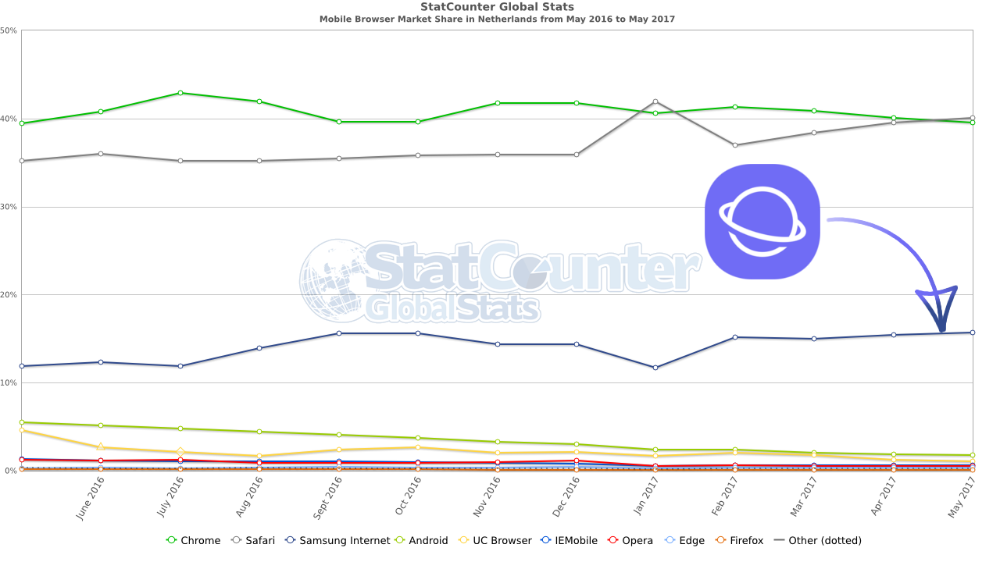

<script>
var captionStyle = 'z-index: 2; text-align: center; background: rgba(0,0,0,0.8); padding: 1em; border-radius: 1em; width: auto; margin: 1em; font-size: 3rem; margin-top: -3em;';
</script>

# {{page.title}}

<!-- Link to trigger conversion script -->
[Convert to Slide Deck](#aslides)

Length: 45 minutes

<blockquote class="dark" style="background-color: #576363 !important; background-image: url(images/me-and-dan.jpg);background-size: cover;min-height: 16em;display: flex;justify-content: flex-start;padding: 0.5em;background-position: center right;align-items: stretch;">
<span style="flex-grow: 1;text-align: right; font-size: 4rem; text-shadow: 0 0 1em #576363;">@lady_ada_king</span>
<span style="font-size: 5rem; text-shadow: 0 0 1em #576363;">@samsunginternet</span>
</blockquote>

<blockquote style="background-color: white;">

</blockquote>

<blockquote style="padding: 0; justify-content: flex-end;">

</blockquote>

<blockquote style="padding: 0; justify-content: flex-end;">

</blockquote>

<script>window._setNextSlide(window.videoSlide);</script>
<blockquote style="padding: 0; justify-content: flex-end;">
<video data-src="images/space-jam.mp4" style="position:absolute; top: 0; left: 0; width:100%; height: 100%; max-height: none; object-fit: cover;"></video>
</blockquote>

<script>window._setNextSlide(window.videoSlide);</script>
<blockquote style="padding: 0; justify-content: flex-end;">
<video data-src="images/360-media.mp4" style="position:absolute; top: 0; left: 0; width:100%; height: 100%; max-height: none; object-fit: cover;"></video>
</blockquote>

<script>window._setNextSlide(window.elByEl());</script>
<blockquote>


</blockquote>

<script>
window._setNextSlide(window.elByEl({
	preserve: 'h1:first-child'
}));
</script>

> # Building immersive media into the web platform
>
> ## Set the environment
>
> ```javascript
> // First, check if the API is available
> if ('SamsungChangeSky' in window) {
>   // Set the spherical panorama image
>   window.SamsungChangeSky({ sphere: 'http://site.com/panorama.jpg' });
> }
> ```
>
> ## Immersive Video
>
> <pre class="highlight"><code><span class="nt">&lt;video</span> <span class="na">src=</span><span class="s">"/360.webm"</span> <span class="na">type=</span><span class="s">"video/webm; dimension=360-lr;"</span><span class="nt">&gt;&lt;/video&gt;</span>
</code></pre>

# Try it out for yourself:

<script>window._setNextSlide(window.videoSlide);</script>
<blockquote style="padding: 0; justify-content: flex-end;">
<video data-src="images/enter-vr.mp4" style="position:absolute; top: 0; left: 0; width:100%; height: 100%; max-height: none; object-fit: cover;"></video>
</blockquote>

# Where is it supported

> 


<blockquote style="padding: 0; justify-content: flex-end;">


</blockquote>

## Head Tracking Demo

<script>window._setNextSlide(window.videoSlide);</script>
<blockquote style="padding: 0; justify-content: flex-end; background-color: black !important;">
<video data-src="images/tracking.m4v" style="position:absolute; top: 0; left: 0; width:100%; height: 100%; max-height: none; object-fit: contain;"></video>
</blockquote>

> ## WebVR does nothing on it's own.

> EXAMPLE!!
> 

> The web works with it to provide rich content.

> WebGL
> 3D rendering

> Web Audio
> 3D Audio

> WebRTC/WebSockets
> Realtime Data, AV streaming

> An entire world wide webs worth of Rest APIs
> Data display, social messaging

> Libraries for animations and physics simulations

> Start thinking about the APIs of the Web in a new fashion!
>
> WebVR isn't just a way to distribute VR content it is a new way to think about the web.


# Destroying the illusion.

> > ## *“Explaining a joke is like dissecting a frog. You understand it better but the frog dies in the process.”*
>
> ― E.B. White

> # A-Frame

> # Web Sockets


## How to get involved in Standards to influence the future of VR

These discussions are happening today!

If anything in this talk has interested you then please get involved.

If you start now you will be able to shape the next medium of the web

I don't know about you guys but I am pretty excited for our VR future.

> # Get involved in standards
>
> ## https://www.w3.org/community/webvr/
>
> ## https://github.com/w3c/webvr

<script type="text/javascript">
window._executeOnNextEl(function (el) {
	var qr = new QRCode(el.querySelector('.qr-target'), "http://o.ada.is/feedback-bulgaria");
	console.log(qr);
});
</script>

<blockquote style="display: block;">
<h1>Please give feedback on this talk so we can learn and improve!</h1>
<div style="display: block;">
<h2>http://o.ada.is/feedback-bulgaria</h2>
<span class="qr-target" style="float: right;background: white;align-self: flex-end;margin: 0.5em;flex-shrink: 0;"></span>
</div>
<h2>@samsunginternet</h2>
</blockquote>

<script>

	// Fancy Emojis
	window._addScript('https://twemoji.maxcdn.com/2/twemoji.min.js')().then(function () {
		twemoji.parse(document.body, {
			folder: 'svg',
			ext: '.svg'
		});
	});

	// Add links to deep link into slides
	var blockquote = Array.from(document.querySelectorAll('body.post > blockquote'));
	var newSpans = [];
	document.querySelector('a[href="#aslides"]').addEventListener('click', function () {
		newSpans.forEach(function (s) {
			s.removeEventListener('click', onclick);
			s.remove();
		});
		newSpans.splice(0);
	});

	blockquote.forEach(function (el) {
		var span = document.createElement('span');
		newSpans.push(span);
		span.textContent = ' View Slide';
		span.addEventListener('click', function onclick() {
			window.removeHashChangeEventListener();
			newSpans.forEach(function (s) {
				s.removeEventListener('click', onclick);
				s.remove();
			});
			init().then(function () {
				document.querySelector('.a-slides_slide-container').dispatchEvent(new CustomEvent('a-slides_goto-slide', {detail: {slide: el.parentNode}}));
			});
		});
		span.setAttribute('class', 'slide-view-button');
		el.appendChild(span);
	});
</script>