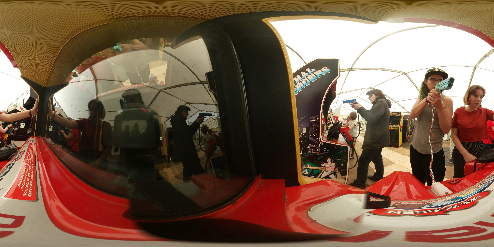
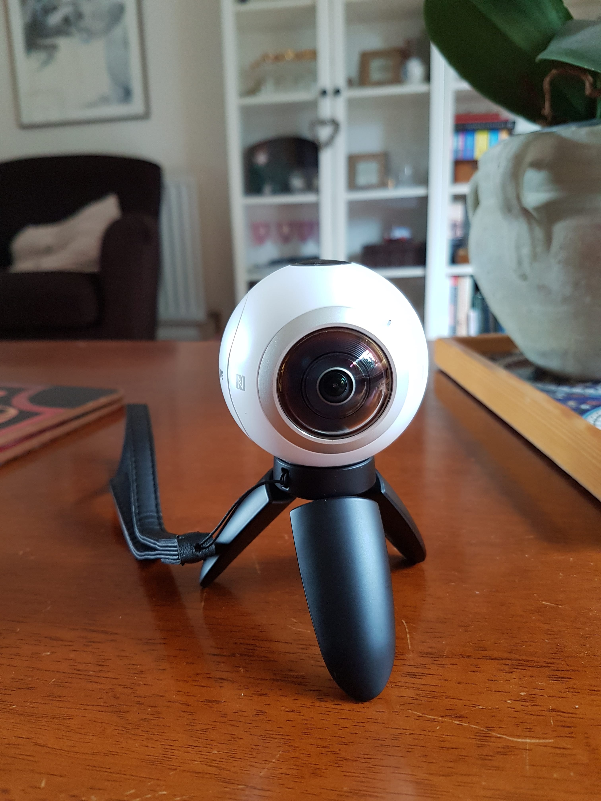

<script>
var captionStyle = 'z-index: 2; text-align: center; background: rgba(0,0,0,0.8); padding: 1em; border-radius: 1em; width: auto; margin: 1em; font-size: 3rem; margin-top: -3em;';
</script>

# {{page.title}}

<!-- Link to trigger conversion script -->
[Convert to Slide Deck](#aslides)

Length: 45 minutes

<blockquote class="dark" style="background-color: #576363 !important; background-image: url(images/me-and-dan.jpg);background-size: cover;min-height: 16em;display: flex;justify-content: flex-start;padding: 0.5em;background-position: center right;align-items: stretch;">
<span style="flex-grow: 1;text-align: right; font-size: 4rem; text-shadow: 0 0 1em #576363;">@lady_ada_king</span>
<span style="font-size: 5rem; text-shadow: 0 0 1em #576363;">@samsunginternet</span>
</blockquote>

<blockquote style="background-color: white;">

</blockquote>

<blockquote>

</blockquote>

<blockquote>

</blockquote>

<script>window._setNextSlide(window.videoSlide);</script>
<blockquote>
<video data-src="images/space-jam.mp4" style="position:absolute; top: 0; left: 0; width:100%; height: 100%; max-height: none; object-fit: cover;"></video>
</blockquote>

<script>window._setNextSlide(window.videoSlide);</script>
<blockquote>
<video data-src="images/360-media.mp4" style="position:absolute; top: 0; left: 0; width:100%; height: 100%; max-height: none; object-fit: cover;"></video>
</blockquote>
<!--
<script>window._setNextSlide(window.elByEl());</script>
<blockquote>


</blockquote>-->

<script>
window._setNextSlide(window.elByEl({
	preserve: 'h1:first-child'
}));
window._cssNextEl({
    padding: '1em',
    justifyContent: 'flex-start'
})
</script>

> # Building immersive media into the web platform
>
> ## Set the environment
>
> ```javascript
> // First, check if the API is available
> if ('SamsungChangeSky' in window) {
>   // Set the spherical panorama image
>   window.SamsungChangeSky({ sphere: 'http://site.com/panorama.jpg' });
> }
> ```
>
> ## Immersive Video
>
> <pre class="highlight"><code><span class="nt">&lt;video</span> <span class="na">src=</span><span class="s">"/360.webm"</span> <span class="na">type=</span><span class="s">"video/webm; dimension=360-lr;"</span><span class="nt">&gt;&lt;/video&gt;</span>
</code></pre>

# Try it out for yourself:

<script>window._setNextSlide(window.videoSlide);</script>
<blockquote>
<video data-src="images/enter-vr.mp4" style="position:absolute; top: 0; left: 0; width:100%; height: 100%; max-height: none; object-fit: cover;"></video>
<h1 style="margin:0; z-index: 2; position: absolute;">http://o.ada.is/simple-vr</h1>
</blockquote>

# Where is it supported

> 


<script>window._setNextSlide(window.elByEl({
    reveal: true
}));</script>
<blockquote>


</blockquote>

## Head Tracking Demo

<script>window._setNextSlide(window.videoSlide);</script>
<blockquote style="background-color: black !important;">
<video data-src="images/tracking.m4v" style="position:absolute; top: 0; left: 0; width:100%; height: 100%; max-height: none; object-fit: contain;"></video>
</blockquote>

<script>window._setNextSlide(window.elByEl());</script>
<blockquote>

<div style="background-color: #4d4d4d;"></div>
<div style="background-color: lavenderblush; padding: 1em;"></div>
</blockquote>

## WebGL

* Basic Shapes
* Lighting
* 3D models

## WebAudio

* Mix Audio
* HRTF - 3D Audio
* Get Mic info

## Libraries

* Animation
* Physics

## Realtime Data

* Web Sockets: Mass sync
* WebRTC Stream Audio/Video/Data to a few

## Speech APIs

* Generate Speech from Text to describe scenes without text
* Use voice commands with speech to text.

<script type="text/javascript">
window._executeOnNextEl(function (el) {
	var qr = new QRCode(el.querySelector('.qr-target'), "http://o.ada.is/vrdemo1");
});
</script>
<blockquote class="a-slides_slide-content">
    
    <span class="qr-target" style="z-index: 1; align-self: flex-start; margin-left: 1em;"></span>
    <h2 style="padding: 0.5em; margin:0; z-index: 1; background: rgba(0,0,0,0.4);">http://o.ada.is/vrdemo1</h2>
</blockquote>

<script>window._setNextSlide(window.videoSlide);</script>
<blockquote style="padding: 0; justify-content: flex-end;">
<video data-src="images/boris-smus-copresence.m4v" style="position:absolute; top: 0; left: 0; width:100%; height: 100%; max-height: none; object-fit: cover;"></video>
<span style="z-index: 2; text-align: center; background: rgba(0,0,0,0.8); padding: 1em; margin: 1em; border-radius: 1em;">WebVR Copresence with WebRTC by Boris Smus</span>
</blockquote>

<!--# Destroying the illusion.
<script>
window._cssNextEl({
    padding: '1em'
});
</script>
> > ## *“Explaining a joke is like dissecting a frog. You understand it better but the frog dies in the process.”*
>
> ― E.B. White-->
<!--
> WebVR introduces new problems for interfaces and accessibility.-->

<!--
> # https://samsunginter.net/word-drop/
-->


<script>
window._setNextSlide(window.elByEl());
window._cssNextEl({
    justifyContent: 'center',
	padding: '1em'
});	
</script>
> <h1 style="text-align: center; font-size: 2.5em;">WebVR isn't just a way to distribute VR content.</h1>
>
> <h1 style="text-align: center; font-size: 2.5em;">VR brings a new way to think about the web.</h1>
>
> <h1 style="text-align: center; font-size: 2.5em;">The web brings a new way to think about VR.</h1>


## Works across devices

until there is enough content that people are regularly browsing in a headset

People probably won't have a head set to hand

Need to support cardboard and gearvr as well as htc vive and occulus rift

<blockquote style="background-blend-mode: normal; ;background-image: url(images/devices.jpg);background-size: cover;min-height: 16em;"></blockquote>

## Supporting user interactions.

Different modes of user input.

<script>
window._cssNextEl({
    backgroundColor: 'lavenderblush'
});	
</script>

> 


## Some cool uses

<script>
window.setDynamicSlide(window.elByEl());
window._cssNextEl({
    padding: '1em'
});	
</script>
<blockquote>
<div>
<h1>Immersive Movies</h1>

</div>
<div>
<h1>Shopping</h1>
<div style="flex-direction: row; display: flex;">


</div>
</div>
<div>
<h1>Education</h1>

</div>
<div>
<h1>Social</h1>
<h2 style="margin:0;">https://metaverse.samsunginter.net</h2>

</div>
</blockquote>

## How to get involved in Standards to influence the future of VR

These discussions are happening today!

If anything in this talk has interested you then please get involved.

If you start now you will be able to shape the next medium of the web

I don't know about you guys but I am pretty excited for our VR future.

<script>
window._cssNextEl({
    padding: '1em',
    justifyContent: 'flex-start'
})
</script>
> # Get involved in standards
>
> ## https://www.w3.org/community/webvr/
>
> ## https://github.com/w3c/webvr

<script type="text/javascript">
window._executeOnNextEl(function (el) {
	var qr = new QRCode(el.querySelector('.qr-target'), "http://o.ada.is/css-day");
});
</script>

<blockquote style="display: block; padding: 1em;">
<h1>Please give feedback on this talk so we can learn and improve!</h1>
<div style="display: block;">
<h2>http://o.ada.is/css-day</h2>
<span class="qr-target" style="float: right;align-self: flex-end;margin: 0.5em;flex-shrink: 0;"></span>
</div>
<h2>@samsunginternet</h2>
</blockquote>

<script>

	// Fancy Emojis
	window._addScript('https://twemoji.maxcdn.com/2/twemoji.min.js')().then(function () {
		twemoji.parse(document.body, {
			folder: 'svg',
			ext: '.svg'
		});
	});

	// Add links to deep link into slides
	var blockquote = Array.from(document.querySelectorAll('body.post > blockquote'));
	var newSpans = [];
	document.querySelector('a[href="#aslides"]').addEventListener('click', function () {
		newSpans.forEach(function (s) {
			s.removeEventListener('click', onclick);
			s.remove();
		});
		newSpans.splice(0);
	});

	blockquote.forEach(function (el) {
		var span = document.createElement('span');
		newSpans.push(span);
		span.textContent = ' View Slide';
		span.addEventListener('click', function onclick() {
			window.removeHashChangeEventListener();
			newSpans.forEach(function (s) {
				s.removeEventListener('click', onclick);
				s.remove();
			});
			init().then(function () {
				document.querySelector('.a-slides_slide-container').dispatchEvent(new CustomEvent('a-slides_goto-slide', {detail: {slide: el.parentNode}}));
			});
		});
		span.setAttribute('class', 'slide-view-button');
		el.appendChild(span);
	});


	var iframes = Array.from(document.querySelectorAll('iframe'));
	var blank = 'about:blank';
	iframes.forEach(function (iframe) {
		var button = document.createElement('button');
		var src = iframe.src;
		iframe.src = blank;
		iframe.dataset.src = src;
		button.addEventListener('click', function () {
			iframe.src = iframe.src === blank ? src : blank;
			if (iframe.src === blank) {
				button.classList.add('blank');
				button.textContent = "Load iFrame";
			} else {
				button.classList.remove('blank');
				button.textContent = "Unload iFrame";
			}
		});
		button.classList.add('load-content-button');
		button.classList.add('blank');
		button.textContent = "Load iFrame";
		iframe.after(button);
	});

	var videos = Array.from(document.querySelectorAll('video'));
	videos.forEach(function (video) {
		var button = document.createElement('button');
		var src = video.src;
        if (src) {
            video.removeAttribute('src');
            video.dataset.src = src;
        }
		button.addEventListener('click', function () {
			video.src = video.dataset.src;
            video.controls = true;
            button.parentNode.removeChild(button);
		});
		button.classList.add('load-content-button');
		button.classList.add('blank');
		button.textContent = "Load Video";
		video.after(button);
	});
</script>