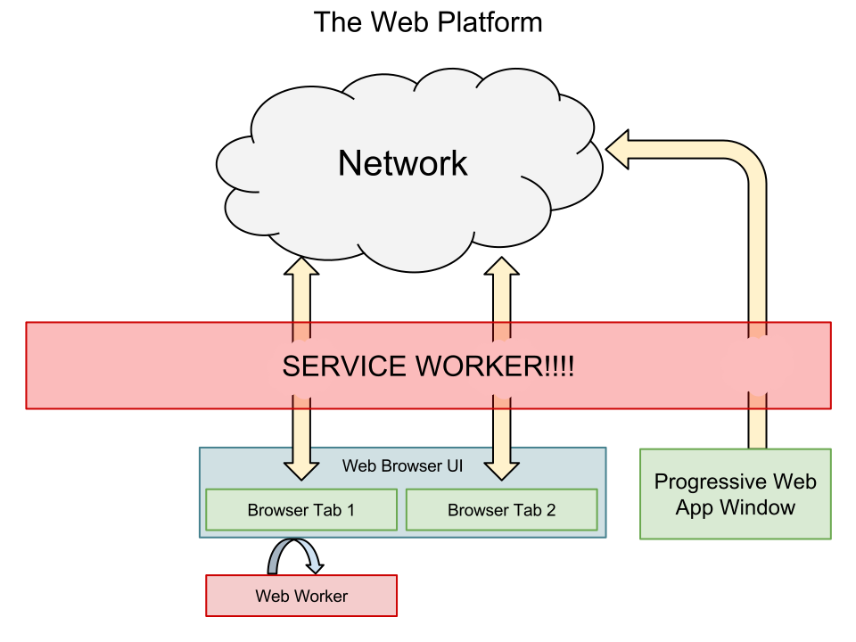

<script>
var captionStyle = 'z-index: 2; text-align: center; background: rgba(0,0,0,0.8); padding: 1em; border-radius: 1em; width: auto; margin: 1em; font-size: 3rem; margin-top: -3em;';
</script>

# {{page.title}}

<!-- Link to trigger conversion script -->
[Convert to Slide Deck](#aslides)

## Abstract

Virtual Reality has tradionally been the domain of the Desktop or Native App. New APIs give a two way benefit allowing
VR content to be delivered quickly through the web platform whilst taking advantage of the many benefits the web offers.

This talk aims to discuss VR as a new platform, in the same way the mobile web was. What lessons can we learn from that era
to avoid dividing the web and how can developers get involved to influence the way WebVR grows.


## VR as a new platform

The current wave of VR has been around for a few years now and has had a wonderous start.

Of the most popular headsets there have been millions of GearVRs sold and Tens of Millions of Cardboard units.

This is only the beginning we will look back on VR today

-- Slide --

As we do on mobile phones in the 80s

-- slide --

Right now there are now 2 Virtual Reality web browsers, for browsing the web inside the headset, Samsung Internet for Gear VR Chrome for Daydream with more coming soon.

There are some new web apis for providing enhanced content for VR headsets

such as enabling the playing of 360 media

-- slide --

and setting the environment.

<script>window.setDynamicSlide(contentSlide([
	{html: `<div class="dark" style="background-color: #576363 !important; background-image: url(images/me-and-dan.jpg);background-size: cover;min-height: 16em;display: flex;justify-content: flex-start;padding: 0.5em;background-position: center right;align-items: stretch;">
<span style="flex-grow: 1;text-align: right; font-size: 4rem; text-shadow: 0 0 1em #576363;">@lady_ada_king</span>
<span style="font-size: 5rem; text-shadow: 0 0 1em #576363;">@samsunginternet</span>
</div>`},
{html: `<div style="background-image: url(images/cellphone.jpg);background-size: cover;min-height: 16em;display: flex;justify-content: flex-end;padding: 0.5em;background-position: center right;">
<small style="color: white; text-align: right;">Michael Douglas in Wall Street (1987)</small>
</div>`},
{video: 'images/space-jam.mp4', captionStyle: captionStyle, caption: 'Samsung Internet for GearVR' },
{video: 'images/360-media.mp4', start: 19, captionStyle: captionStyle, caption: 'window.SamsungChangeSky({ sphere: \'http://site.com/blue-sky.jpg\' })', callback: function () {
	var caption = this.querySelector('.caption');
	setTimeout(function(){caption.textContent = '<video controls src="360video.mp4" type="video/mp4; dimension=360-lr;">'}, 14000);
}},
]));</script>
<blockquote style="padding: 0;">
<h2>Picture of me and dan</h2>
<h2>Old mobile phone</h2>
<h2>Video of Samsung Internet in Browser</h2><video src="images/space-jam.mp4"></video>
<h2>360deg media being handled in the browser</h2><video src="images/360-media.mp4"></video>
</blockquote>

## The state of VR today (WebGL based)

There is a suite of new APIs for enhancing WebGL to access head tracking, and handling the distortion and multiple displays needed for VR headsets.

These are known as the WebVR APIs

Using these one can bring content from 3D to the web

As well as the obvious gaming applications this can be used for shopping, education, sports, health and travel

The web makes it ideal for single use throw away experiences with the aim of going viral or providing a low barrier for entry.

One can take advantage of the web's powerful apis to enhance these experiences

There is a polyfill to allow these apis to be used on iOS and mobile chrome with a google cardboard.

<script>setDynamicSlide({
	setup: function () {
		this.querySelector('video').currentTime=0;
		this.querySelector('video').pause();
		this.querySelector('pre').textContent = 'VRDisplay.requestPresent({ source: myCanvas });';
	},
	action: function *() {
		this.querySelector('video').play();
		yield;

		this.querySelector('pre').textContent = 'VRDisplay.getPose()';
		yield;

	},
	teardown: function () {
		this.querySelector('video').pause();
	}
});</script>
<blockquote style="padding: 0; justify-content: flex-end;">
<video src="images/enter-vr.mp4" style="position:absolute; top: 0; left: 0; width:100%; height: 100%; max-height: none; object-fit: cover;"></video>
<pre style="z-index: 2; text-align: center; background: rgba(0,0,0,0.8);">VRDisplay.requestPresent({ source: myCanvas });</pre>
</blockquote>

# Copresence and Metaverse

> # Remote Copresence on the Web
>
> ## *Copresence: occurrence of two or more things together in the same place and time*

### P2P Via WebRTC

WebRTC is an Api to allow peer to peer messaging between browsers.

WebRTC primarily used for Video Chat now will probably become the primary
method of delivering copresence. Allowing multiple avatars to share the same virtual space.

Explain how it can be used for Copresence with some code

<script>setDynamicSlide({
	setup: function () {
		this.querySelector('video').currentTime=0;
		this.querySelector('video').pause();
		this.querySelector('span').style.display = 'block';
		this.querySelector('pre').style.display = 'none';
	},
	action: function *() {
		this.querySelector('video').play();
		yield;

		this.querySelector('span').style.display = 'none';
		const pre = this.querySelector('pre');
		pre.style.display = 'block';

		pre.textContent = 'var peerConn = new RTCPeerConnection(config);';
		yield;

		pre.textContent = `navigator.mediaDevices.getUserMedia({
	audio: true,
	video: false
})
.then(function(stream) {
	var microphone = audioCtx.createMediaStreamSource(stream);
	var dest = audioCtx.createMediaStreamDestination();
	microphone.connect(dest);
	peerConn.addStream(dest.stream);
})`;
		yield;

		pre.textContent = 'peerConn.createDataChannel();';
		yield;
	},
	teardown: function () {
		this.querySelector('video').pause();
	}
});</script>
<blockquote style="padding: 0; justify-content: flex-end;">
<video src="images/boris-smus-copresence.m4v" style="position:absolute; top: 0; left: 0; width:100%; height: 100%; max-height: none; object-fit: cover;"></video>
<span style="z-index: 2; text-align: center; background: rgba(0,0,0,0.8); padding: 1em; margin: 1em; border-radius: 1em;">WebVR Copresence by Boris Smus</span>
<pre style="z-index: 2; background: rgba(0,0,0,0.8); padding: 1em; margin: 1em; border-radius: 1em;"></pre>
</blockquote>


## How the web platform can enhance VR

The web as a platform has been delivering media content for years now.

There are many reasons Native platforms can be trump the web with regard to quality.

But this is a trade off we make for the many benefits we gain from the web.

-- slide --

The web brings us the ability to reach a large audience across a wide variety of platforms,

We can take advantage of URLs and deep linking

The web also has access to many useful APIs which VR will bring to entirely new relevance.

<script>window.setDynamicSlide(window.elByEl());</script>
> # Why do VR on the web?
>
> > ## *"If visual fidelity was all that mattered we would be watching blu-rays not Netflix"*
> >
> > ### -- Josh Carpenter

## Expectations by being on the web

Even though one may be making something new and amazing, the wow factor for VR will wear off and users have a short attention span.

The lessons we've learnt in engaging uers on the web are still applicable here

Primarily reduce the barrier between the user and content.

Start fast. Each barrier to entry will lose a signifcant portion of your users.

The advantage of the web is that one link click takes you to the content but that advantage is lost easily.

* Avoid interstitials redirecting users to different devices or platforms
* Avoid long loading
* Work on desktop but enhance into VR

Think of showing VR content the same way you would use video content,

* Content is buffered, not loaded all in one go
* Content is visible on the page straight away
* Content quality improves with bandwidth and device power

<script>setDynamicSlide(contentSlide([
	{html: '<h1 style="margin-left: 1em;">The Web Comes with Expectations</h1><div style="justify-content: flex-end; padding: 0;"><h2 style="' + captionStyle + '">Study by Google on Loading time and Engagement</h2></div>'},
	{video: 'images/gun.m4v', caption: 'http://gun.playcanvas.com', style:'position: absolute; top:0; left: 0; width: 100%; height: 100%; z-index: -1; object-fit: cover;', captionStyle: captionStyle},
]));</script>
<blockquote style="justify-content: flex-end; padding: 0;">
<ul>
<li>&lt; 3s Acceptable</li>
<li>&lt; 1s Good</li>
<li>&lt; 0.5s Ideal</li>
</ul>
<video src="images/gun.m4v" muted></video>
</blockquote>

### Service Workers and Cache APIs

There are new APIs for advanced network control known as a Service Worker

*Who here has used Service Workers Before?*

Using the Service worker to cache assets, models etc

Work offline, reduce network usage, handle assets

Here we have a Service worker registered to cache all out intial assets so they work offline and are available quickly.

We can then send messages to the service worker to cache additional content as it is needed, e.g. the assests for the next level

this allows us to get started quickly and pull down additional assets in the background

Cross-origin Service Workers & Foreign Fetch libraries and assets common across VR experiences can be cached and made available quickly for a fast VR browsing experience.

The new Crossorigin Service Workers Foreign fetch will allow reusable VR components such as popular models or libraries to be cached on the client so
have a large chance of not needing to be downloaded again.

<script>setDynamicSlide(elByEl())</script>
> 
>
> ```js
// in the service worker
self.addEventListener('install', function(event) {
	caches.open('my-cache')
	.then(cache => cache.addAll([
		'texture.jpg',
		'model.gltf',
		'engine.js'
	]));
});
>
self.addEventListener('fetch', function(event) {
  event.respondWith(
    caches.match(event.request)
	.then(function(response) {
        return response || fetch(event.request);
    });
  );
});
```
>
> > ```js
// in the service worker
self.addEventListener('message', function(event) {
	if (event.data.action === 'CACHE') {
		caches.open('my-cache')
		.then(cache => cache.addAll(event.data.assets));
	}
});
```
> >
> > ```js
// On the client
navigator.serviceWorker.controller.postMessage({
	action: 'CACHE',
	assets: [
		'/level2.gltf',
		'level2-sounds.wav'
	]
})
```

## Works across devices

until there is enough content that people are regularly browsing in a headset

People probably won't have a head set to hand

Need to support cardboard and gearvr as well as htc vive and occulus rift

<blockquote style="background-blend-mode: normal; ;background-image: url(images/devices.jpg);background-size: cover;min-height: 16em;"></blockquote>

## The potential future of VR in the web (Markup CSS3D)

The web isn't just WebGL though we have 25 years of content already available

The web should start providing additional APIs to bring this content into the future

Should the web handle the concept of a persistent avatar to maintain a user across multiple domains or should that be left to the web platform?

Should html be able to mark up 3D models or should it be left up to WebGL?

What about the metaverse?

The idea of the metaverse is that of a persistent shared virtual space

Can this grow out of the web platform?

<script>setDynamicSlide(elByEl());</script>

> # The Future?
>
> ```css
.container {
	overflow-y: scroll;
	perspective: 600px;
	perspective: real3d; /* handle headset perspective?! */
	height: 100vh;
}
.container .hero {
	transform: translateZ(100px);
}
```

## How to get involved in Standards to influence the future of VR

These discussions are happening today!

If anything in this talk has interested you then please get involved.

If you start now you will be able to shape the next medium of the web

I don't know about you guys but I am pretty excited for our VR future.

> # Get involved in standards
>
> ## https://www.w3.org/community/webvr/
>
> ## https://github.com/w3c/webvr
>
> ## @samsunginternet

<script>

	// Fancy Emojis
	window._addScript('https://twemoji.maxcdn.com/2/twemoji.min.js')().then(function () {
		twemoji.parse(document.body, {
			folder: 'svg',
			ext: '.svg'
		});
	});

	// Add links to deep link into slides
	var blockquote = Array.from(document.querySelectorAll('body.post > blockquote'));
	var newSpans = [];
	document.querySelector('a[href="#aslides"]').addEventListener('click', function () {
		newSpans.forEach(function (s) {
			s.removeEventListener('click', onclick);
			s.remove();
		});
		newSpans.splice(0);
	});

	blockquote.forEach(function (el) {
		var span = document.createElement('span');
		newSpans.push(span);
		span.textContent = ' View Slide';
		span.addEventListener('click', function onclick() {
			window.removeHashChangeEventListener();
			newSpans.forEach(function (s) {
				s.removeEventListener('click', onclick);
				s.remove();
			});
			init().then(function () {
				document.querySelector('.a-slides_slide-container').dispatchEvent(new CustomEvent('a-slides_goto-slide', {detail: {slide: el.parentNode}}));
			});
		});
		span.setAttribute('class', 'slide-view-button');
		el.appendChild(span);
	});
</script>