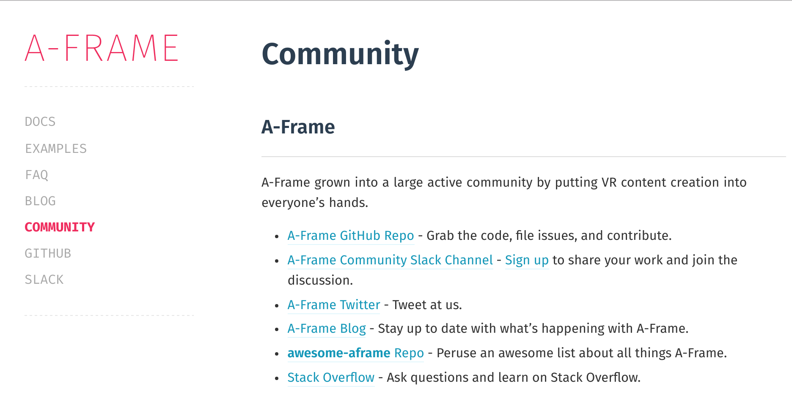

# {{ page.title }}

<!-- Link to trigger conversion script -->
[Convert to Slide Deck](#aslides)

<span>Length should be <span id="a-frame-clock">30</span> minutes.</span>

So I have a bout 30 mins, with time for questions, to talk to you about WebVR.

I am going to focus on geting started and building some demos with a popular library.

* Before we begin, who here would consider them selves a developer

* Who here has written some HTML?

VR Browsers:

* SerVR (Mozilla)
* Carmel (Occulus)
* Chrome (Google)
* Samsung Internet for GearVR (Samsung)

VR Compatible Browsers:

* Chrome for desktops (flag)
* Firefox for Desktop (needs extension)

<!-- This slide uses information from _config.yml -->
<blockquote class="dark" id="splash-slide" style="background-image: url('https://i.imgur.com/1CuaofJ.jpg');">
<h1>{{ page.title }}</h1>
<h3>{{ page.description }}</h3>
<h2>{{site.author.name}} - {{site.author.company}}</h2>
</blockquote>

# Why VR and the web go hand in hand

The world wide web is the most prominent content delivery platform, it has unparalelled reach and grants us the ability to share and stream content.

Its network model allows us to enjoy multimedia experiences such as games and movies without downloading the whole thing.

The web can be enjoyed across a wide variety of platforms from phones to desktops and tvs.

URLs allow for linking and sharing content easily in a format familiar to the three and half billion people who use the internet.

VR for the web, known as WebVR, allows us to make the most of the Web's strongest powers to leverage 3D models, images, videos and audio to produce 3D worlds to immerse our readers in.

Recently the WebVR spec has become more mature. It can be used in Samsung's Internet Browser for the Gear VR. In addition scripts such as the `WebVR Polyfill` to allow you to use WebVR with Google Cardboard on other mobile browsers such as Chrome and Safari.

The proportion of people who access the internet on mobile devices is ever increasing and headsets can be just a piece of cardboard.

The Progressive Web Apps pattern allows for Web VR enabled sites which behave like apps allowing users to save great experiences to their homescreen to experience again and again.

<script>window.aSlidesSlideData['slide-why-vr-and-the-web-go-hand-in-hand'] = window.contentSlide([
	{image: 'images/MobileBroadbandInternetPenetrationWorldMap.svg', caption: '## Mobile Broadband Internet Saturation'},
	{image: 'images/cardboard.jpg'}
]);</script>
> 

# What is WebVR?

WebVR is an umbrella term for everything that goes into making the Web Work in Virtual Reality.

Right now efforts have been focused on WebGL and getting media content working in the VR browsers.

Such as 360 Videos and Interactive 3D graphics such as games.

That is only one side of the web though.

At last weeks w3c workshop for WebVR in San Jose there were discussion about how WebVR can act as a progressive enhancement to the 2D web we know today.

This talk will focus on building Interactive 3D graphics content working in the web.

There are many libraries for this and we will focus on one in Particular, A-Frame.

<script>window.setDynamicSlide(window.playVideo);</script>
> # What is Web VR?
>
> <video src="images/tracking.m4v" muted autoplay controls loop></video>

# What is A-Frame

A-Frame a is a JavaScript library to abstract away the difficult and the rote parts of Virtual Reality.

A-Frame is built on top of another library called THREE.js

It also includes the WebVR polyfill.

The WebVR polyfill allows all smartphones to be VR capable with Google Cardboard

THREE.js provides a nice way to work with 3D rendering.

A-Frame simplifies everything and abstracts away the more difficult bits.

Allowing us to get started straight away!

> 


WebVR is still in development so behind a flag.

It can be used without a flag in mobile browsers using the polyfill but needs to be turned on for native use.

As Gear VR is currently the most popular VR Browser (Over 1 million downloads!) I will show you how

The Gear VR does not run VR websites out of the box it needs to be turned on.

This is a bit annoying and confusing because my demos wouldn't work and I didn't know why.

<blockquote class="dark" style="background-image: url('images/webvr-enable.jpg');">
	<h2>To enable webvr in GearVR open this URL in the WebVR browser</h2>
	<p><br />&nbsp;</p>
	<h1>internet://webvr-enable</h1>
</blockquote>


# Composing scenes with A-Frame

A-Frame is webby.

Well for one it looks like HTML and can be written directly into your markup.

It is based on the custom elements api and

It gives new custom html elements for building virtual reality

*Who here has built a website by typing out html before?*

Like HTML you can do an awful lot without writing a single line of javascript. But you can still use JavaScript to add extra functionality of you want.

It is also modular and extensible.

Modular means that I can write a component. For example. A component to give a heads up display or fancy lighting.

Then anyone can include it in their scenes without needing to write complex JavaScript.

It is extensible because my components will be based on other A-Frame components and you can release components that depend on mine.

You are not required to write a single line of JavaScript unless you want to make your own components.

* Walk through this line by line *

> ```html
	<html>
	<head>
		<script src="js/a-frame.js"></script>
	</head>
	<body>
		<a-scene>
			<a-sphere position="0 1.25 -1" radius="1.25" color="#EF2D5E"></a-sphere>
			<a-box position="-1 0.5 1" rotation="0 45 0" color="#4CC3D9"></a-box>
			<a-cylinder position="1 0.75 1" radius="0.5" color="#FFC65D"></a-cylinder>
			<a-plane rotation="-90 0 0" width="4" height="4" color="#7BC8A4"></a-plane>
			<a-sky color="#ECECEC"></a-sky>
		</a-scene>
	</body>
	</html>
```

# a-frame-basic-demo

This html from the previous slide gives us this.

But A-Frame gives us lots of hidden extras, all the basics to get started:

* The scene already has lighting
* It has a Camera
* That camera can be moved around by using the Arrow keys and clicking and dragging
* If you open it on your phone it is controlled by moving your phone
* It even has in built VR support, for both Cardboard devices and VR Headsets like the Samsung Gear VR

All of this functionality can be overridden if you don't like it or if you want more control.

<script>window.aSlidesSlideData['slide-a-frame-basic-demo'] = window.iframeSlide</script>

> <iframe src="basic.html" seamless="seamless"></iframe>
>
> ## {{ site.url }}/basic.html


# Actually building something

The first thing a lot of people build is a 360 degree photo/video Viewer.

It makes a great first project as it has very few components

So we'll look at that first as it is a demo with few moving parts.

<script>window.aSlidesSlideData['slide-actually-building-something'] = window.iframeSlide</script>

> <iframe src="360-simple.html" seamless="seamless"></iframe>
>
> ## {{ site.url }}/360-simple.html

Here I have some images I want to use.

These go into the a-assets tag, this tells a-frame to preload these for later.

We override the camera, by defining our own with the keyboard controls disabled. We don't want too let the user move around in the scene.

The final piece is the sky, the sky is an evenly lit inside out sphere. We give it the image we want to display and it shows it off.

This has all the features we want from a 360 image viewer, you can rotate the camera, view it immersively in vr and all in 7 lines of html

> ```html
<a-scene>
	<a-assets>
		
	</a-assets>
>
	<a-camera wasd-controls="enabled: false;"></a-camera>
>
	<a-sky src="#img1"></a-sky>
>
</a-scene>
```

The image itself looks like this:

> 

I took it with my 360 camera (no reason to post this I just think it is adorable):

> 

# Adding some interactivity

If you are comfortable writing JavaScript and want to do something more advanced

You can, you can use JavaScript to control a-frame just like you would use it on normal html

Here I have written a small script to rotate through some images whenever I click.

> ```html
<a-scene>
	<a-assets>
		
		
		
	</a-assets>
>
	<a-camera wasd-controls="enabled: false;"></a-camera>
	<a-sky src="#img1"></a-sky>
>
</a-scene>
>
<script>
	var index = 0;
	var images = document.querySelectorAll('a-assets img');
	var sky = document.querySelector('a-sky');
	window.addEventListener('click', function () {
		index = (index + 1) % images.length;
		sky.setAttribute('src', '#' + images[index].id);
	});
</script>
```

# Demo 360 Slideshow

<script>window.aSlidesSlideData['slide-demo-360-slideshow'] = window.iframeSlide</script>

> <iframe src="360.html" seamless="seamless"></iframe>
>
> ## {{ site.url }}/360.html


# Introduce some tools for making 3d content

Enough showing you my holiday photos, what if you want to actually include a more complex 3D object:

A-Frame comes with a whole bunch of geometric primitives.

By one sided I mean that if you were to view it from the back you don't see anything.

> * Box
> * Circle (One sided)
> * Cone
> * Cylinder Primitive
> * Plane (One sided)
> * Ring
> * Sphere
> * Torus (A donut)
> * Torus Knot

# One Sided

In 3D unless specified otherwise flat shapes are one sided

By one sided I mean that if you were to view it from the back you don't see anything.

But there is only so much you can do with primitives.

We can make them a little more complex by attatching them together.

<script>window.aSlidesSlideData['slide-one-sided'] = window.iframeSlide</script>

> <iframe src="one-sided.html" seamless="seamless"></iframe>
>
> ## {{ site.url }}/one-sided.html

# Models from Primitives

By making one object a child of another they become attached together.

The child is transformed in the same way as the parent.

By transformed I mean the way it is scaled, rotated or positioned.

This keeps them stuck together.

<script>window.aSlidesSlideData['slide-models-from-primitives'] = window.iframeSlide</script>

> ```html
	<a-box position="0 2 0" color="red">
>
		<!-- This blue box is a child of the red box -->
		<a-box position = "0.5 0.5 0.5" color="blue"></a-box>
>
		<!-- Spin the red box -->
		<a-animation repeat="indefinite" attribute="rotation" easing="linear" to="0 360 0" dur="2000"></a-animation>
	</a-box>
```
> <iframe src="two-boxes.html" seamless="seamless"></iframe>

# Scene Graphs

This behaviour is known as a scene graphs

It creates a heirarchy of items in the scene. So you can reuse models and attach them to other objects.

E.g. A model bus only needs one chair which can then be reused and attatched to the bus again and again.

This is good because each unique model is expensive but reusing it is cheap.

The example behind me is just a more elaborate version of the last slide.

* The eyes are children of the head
* Which is a child of the body
* Which is a child of the robot

It is being transformed elaborately

* The robot is being shrunk and grown
* the head is being rotated
* Through all this the eyes stay in place

<script>window.aSlidesSlideData['slide-scene-graphs'] = window.iframeSlide</script>

> <iframe src="scene-graph.html" seamless="seamless"></iframe>
>
> ## {{ site.url }}/scene-graph.html


# Third Party components

A-Frame like *Unity* is based on an **Entity Component System**

Which means that you control entities with components containing logic, systems manage the whole scene.

Components are usually small and single use

A-Frame provides lots of components

Which is nice but they probably don't do every thing you want.

There is a rich community built around a-frame.

Community components can provide nice enhancements such as UI elements

If you do not find a component which does what you want.

You can make your own components as well.

There is a lot to take in when extending A-Frame for the first time.

I was totally lost.

I reached out to A-Frame community by joining the A-Frame slack channel.

They are really friendly and very helpful.

I asked where to begin and some of the best advice I recieved was to create your own component.

This seemed daunting at first but once I got stuck in and asked for some help it began to make sense.

This really allowed me to get to grips with how A-Frame works on the inside.


> 
>
> ## https://aframe.io/community/


# What can Components do?

The most fundamental element in a-frame is the `<a-entity>`

An `<a-entity>` is an empty THREE.js group with no geometry or material.

Components are the discreet bits of logic which power A-Frame.

Usually invoking THREE.js functions to perform their task.

They provide the interface between the mark up (HTML) and the 3D rendering engine THREE.js

They are entity agnostic.

They do not care what they are attatched to.

For example the position component just sets the objects position in 3D space.

The rotation component rotates the entity by an angle in degrees.

More complex components such as geometry or material have properties defined like the `style` attribute;

<script id="what-can-components-do">window.setDynamicSlide(window.elByEl())</script>

> <code><span style="background: yellow;">&lt;a-entity&gt;&lt;/a-entity&gt;</span></code>
>
> <code>&lt;a-entity <span style="background: yellow;">position="0 1 0"</span>&gt;&lt;/a-entity&gt;</code>
>
> <code>&lt;a-entity position="0 1 0" <span style="background: yellow;">rotation="0 90 0"</span>&gt;&lt;/a-entity&gt;</code>
>
> <code>&lt;a-entity position="0 1 0" rotation="0 90 0" <span style="background: yellow;">geometry="primitive: box; width: 3; height: 2; depth: 2;"</span>&gt;&lt;/a-entity&gt;</code>
>
> <code>&lt;a-entity position="0 1 0" rotation="0 90 0" geometry="primitive: box; width: 3; height: 2; depth: 2;" <span style="background: yellow;">material="color: red;"</span>&gt;&lt;/a-entity&gt;</code>

# Reusing Components

They are usually totally agnostic to what they get attatched to.

For example we can take the 'wasd-controls' off the camera and attach them to our racing ship from earlier.

> ```html
<a-scene>
>
	<!-- controls  disabled -->
	<a-camera wasd-controls="enabled: false;"></a-camera>
>
>
	<!-- controls  enabled -->
	<a-entity wasd-controls="enabled: true;">
		<a-obj-model src="#Feisar-ship-obj" mtl="#Feisar-ship-mtl" id="ship"></a-obj-model>
	</a-entity>
>
</a-scene>
```

# Component move demo

As you can see now the camera does not move but the ship does

I'm beginning to think we could do something cool with this...

<script>window.aSlidesSlideData['slide-component-move-demo'] = window.iframeSlide</script>

> <iframe src="moving-the-wasd-controller.html" seamless="seamless"></iframe>
>
> ## {{ site.url }}/moving-the-wasd-controller.html

# Making a new component

A component has two parts a schema and set of callback functions.

The schema defines what data gets passed into the component from the attributes defined in the markup.

The data is passed into `init` and `update` functions. It is also available on `this.data` in any of the component's functions.

These are functions which are called during the component's life cycle.

you can call any of these by going `el.components.myComponent.foobar()`;

| function name  | When called                                  |
|----------------|----------------------------------------------|
| init           | When the component is first used per element |
| update         | After init and whenever the data is changed  |
| tick           | Once per frame                               |
| remove         | when the component needs to be torn down     |
| foobar         | function available to be called later        |

This example is a real example taken from the a-frame source code.

It is the `position` component it shows that components should be small, single use and reusable.

Think the UNIX philosiphy.

For communication between component you can emit events.

Lots of components emit events for other components to hook into or even for custom javascript.

<script id="defining-a-component">window.setDynamicSlide(window.elByEl())</script>

>
> ```javascript
	// Simple one property schema
	// <a-entity component1="1 2 3"></a-entity>
	registerComponent('component1', {
		schema: {type: 'vec3'}
	});
>
	// Multi-property property schema
	// <a-entity component2="oranges: blah; someEl: #thatEl;"></a-entity>
	registerComponent('component2', {
		schema: {
			apples: {default: 2}, // implied to be a number
			oranges: {default: ''} // implied to be a string
			someEl: {type: selector}
		}
	});
>
	// Built in types:
	// array, boolean, color, int, number, selector, selectorAll, src, string, time, vec2, vec3, vec4
```
>
>
>
> ```javascript
>
	registerComponent('component2', {
		schema: {},
		init: function () {
>
			// Called only once when component initialised
			this;            // <= the component
			this.data;       // <= the data from the dom in the format defined by the schema
			this.el;         // <= the DOM element
			this.el.object3D // <= The THREE.js 3D model
		},
		update: function () {
			// Called after init and whenever attributes on the element are changed
		},
		tick: function () {
			// Called once per frame
		},
		remove: function () {
			// Use this to undo the effects of the component
			// Called when the component is removed
			// also when the attatched el is deleted.
		}
	})
```
>
>
> ```javascript
// Copy-pasted from the A-Frame source code.
>
registerComponent('position', {
  schema: {type: 'vec3'},
>
  update: function () {
    var object3D = this.el.object3D;
    var data = this.data;
    object3D.position.set(data.x, data.y, data.z);
  }
});
```
>
> <h2> Be small, single use and reusable. <blockquote>The unix philosiphy: "Do one thing and do it well."</blockquote></h2>

# Primitives

Primitives are just `a-entity`s with a bunch of preset components.

For example this is a very large plane which looks like an ocean.

It uses 3 components, `geometry`, `rotation` and `material`

The mappings section allow  easy ways to control some comoonents.

> ```javascript
// <a-ocean-plane width="100" height="100"></a-ocean-plane>
AFRAME.registerPrimitive('a-ocean-plane', {
	defaultComponents: {
		geometry: {
			primitive: 'plane',
			height: 10000,
			width: 10000
		},
		rotation: '-90 0 0',
		material: {
			shader: 'standard',
			color: '#8ab39f',
			metalness: 1,
			roughness: 0.2,
			opacity: 0.8
		}
	},
	mappings: {
		width: 'geometry.width',
		height: 'geometry.depth',
		color: 'material.color',
		opacity: 'material.opacity'
	}
});
```

# Some guidlines

* Avoid teleporting the user in a single frame
* Avoid solid colour as due to screen imperfections it will make it seem stuck.
* Avoid accelerating or rotating the camera unless in well expected smooth fashion, sudden motions will make your user seasick.
* Keep framerates consistent as it has the same effect as above.
* Do provide visual feedback on interactive elements like a glow or a wiggle.
* Do make any text large, thick and clear

Most of all **HAVE FUN**!!

Some guides to building good expereinces:

My slides are online if you want to find this later

> # Most important: **Have fun!**
>
> ## Guide for making VR: https://o.ada.is/occulus-vr-guide
>
> ## Guide for UI elements: https://o.ada.is/leap-motion-vr

# The future of WebVR

Before I finish I would like to tell you a bit about the direction I can see WebVR growing.

The current webvr implementations rely on a `<canvas>` element usually with WebGL.

But it is not the be-all and end all for Virtual Reality in the Web

After all the Web has 25 years of history behind it.

Extending the existing web to work in the new VR browsers will be an important step.

If you would like to get involved please check out the w3c WebVR community group.

There is a lot of energy in WebVR right now and it would be great to see more participation in the discussions.

> # https://www.w3.org/community/webvr/

# Demos

So I am going finish now

To leave you to play with some demos and get some inspiration.

And ask me some questions.

> ##  [https://jsbin.com/fugatar/edit](https://jsbin.com/fugatar/edit)
>
> Basic Demo, geometry, material, sky
>
> ## [https://jsbin.com/xilaja/edit](https://jsbin.com/xilaja/edit)
>
> 3D Sound and Interactions
>
> ## [https://jsbin.com/dunipu/edit](https://jsbin.com/dunipu/edit)
>
> Physics

<script>
	var iframes = Array.from(document.querySelectorAll('iframe'));
	var blank = 'about:blank';
	iframes.forEach(function (iframe) {
		var button = document.createElement('button');
		var src = iframe.src;
		iframe.src = blank;
		iframe.dataset.src = src;
		button.addEventListener('click', function () {
			iframe.src = iframe.src === blank ? src : blank;
			if (iframe.src === blank) {
				button.classList.add('blank');
				button.textContent = "Load iFrame";
			} else {
				button.classList.remove('blank');
				button.textContent = "Unload iFrame";
			}
		});
		button.classList.add('iframe-button');
		button.classList.add('blank');
		button.textContent = "Load iFrame";
		iframe.after(button);
	});

	var blockquote = Array.from(document.querySelectorAll('blockquote'));
	var newSpans = [];
	document.querySelector('a[href="#aslides"]').addEventListener('click', function () {
		newSpans.forEach(function (s) {
			s.removeEventListener('click', onclick);
			s.remove();
		});
		newSpans.splice(0);
	});
	blockquote.forEach(function (el) {
		var span = document.createElement('span');
		newSpans.push(span);
		span.textContent = ' View Slide';
		span.addEventListener('click', function onclick() {
			window.removeHashChangeEventListener();
			newSpans.forEach(function (s) {
				s.removeEventListener('click', onclick);
				s.remove();
			});
			init().then(function () {
				document.querySelector('.a-slides_slide-container').dispatchEvent(new CustomEvent('a-slides_goto-slide', {detail: {slide: el.parentNode}}));
			});
		});
		span.setAttribute('class', 'slide-view-button');
		el.appendChild(span);
	});
</script>