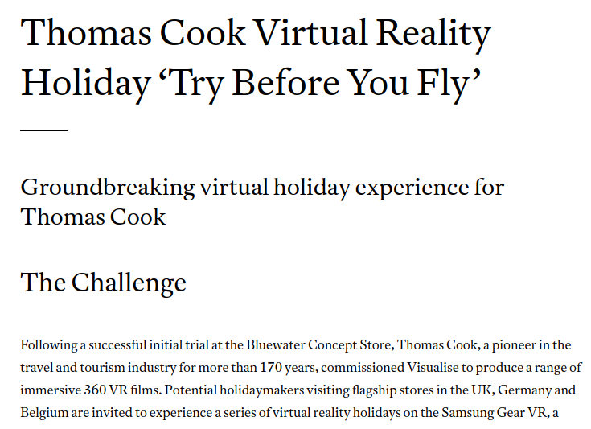
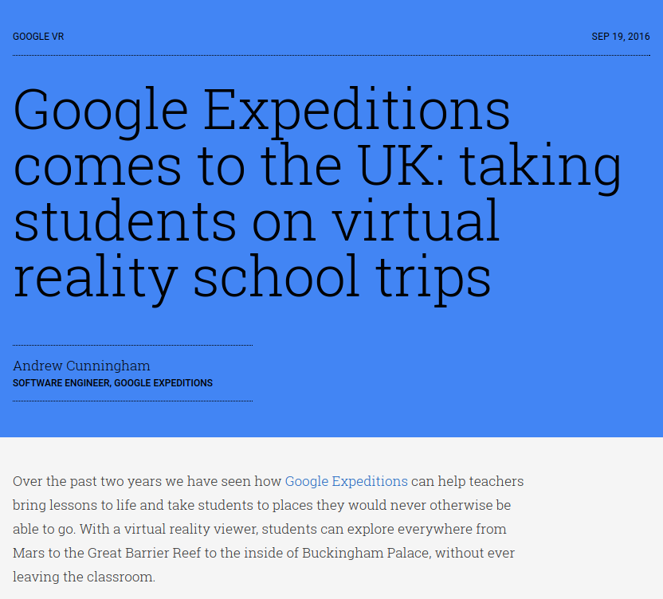
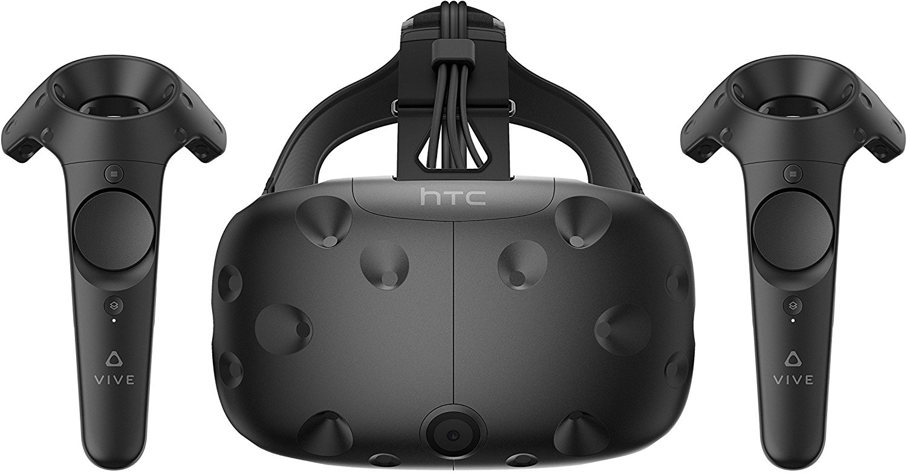

# {{page.title}}

<!-- Link to trigger conversion script -->
[Convert to Slide Deck](#aslides)

Length: 45 minutes

The goals of this talk is to give your the tools to start building VR in the web.

<blockquote class="dark" style="background-color: #576363 !important; background-image: url(images/me-and-dan.jpg);background-size: cover;min-height: 16em;display: flex;justify-content: flex-start;padding: 0.5em;background-position: center right;align-items: stretch;">
@lady_ada_king
@samsunginternet
</blockquote>

<blockquote style="background-color: white;">

</blockquote>

> # Jargon
>
> ## VR, Virtual Reality, fully immersive, replaces reality with a Virtual Reality. 
>
> ## AR/MR, Augmented/Mixed Reality, a combination of Reality and Digital Content
>
> ## XR, Cross Reality, Umbrella term for all immersive media 

<blockquote>

</blockquote>

<blockquote>
<video data-src="images/space-jam.mp4" style="position:absolute; top: 0; left: 0; width:100%; height: 100%; max-height: none; object-fit: cover;"></video>
</blockquote>

# Try it out for yourself:

<blockquote>
<video data-src="images/enter-vr.mp4" style="position:absolute; top: 0; left: 0; width:100%; height: 100%; max-height: none; object-fit: cover;"></video>
<h1 style="margin:0; z-index: 2; position: absolute;">http://o.ada.is/simple-vr</h1>
</blockquote>

# Where is it supported

> 

> # State of WebVR
>
> ## W3C community group.
>
> ## Standard still in flux
>
> ## Looking to become a W3C working group once stable.

<blockquote>

</blockquote>

## Head Tracking Demo

<blockquote style="background-color: black !important;">
<video data-src="images/tracking.m4v" style="position:absolute; top: 0; left: 0; width:100%; height: 100%; max-height: none; object-fit: contain;"></video>
</blockquote>

> 
<h1 style="text-align: center; font-size: 2em;">WebVR requires WebGL</h1>

> 
<h1 style="text-align: center; font-size: 2em;">WebGL is Hard</h1>

> 

<blockquote class="heirarchy-grid" style='display: grid; grid-template-columns: 1fr 1fr;grid-template-rows: 1fr 1fr 1fr; padding: 0.5em;'>
	
WebGl

WebVR

	
Three.js

	
A-Frame

React VR

	
</blockquote>

<blockquote style="padding: 0.5em;">
	

		<h2>A-Frame</h2>
		
Web Component library for describing 3D WebGL scenes using HTML!

		
https://aframe.io

	

	

		
	

</blockquote>

> <iframe style="flex-grow: 1;" src="basic.html" seamless="seamless"></iframe>
> <h2 style="margin:0;">https://ada.is/webvr/basic.html</h2>

<blockquote style="justify-content: center;">
<h1 style="align-self: center; text-align: center; font-size: 2em;">Debugging A-Frame</h1>
<h1 style="align-self: center; text-align: center; font-size: 2em;">Making engaging content</h1>
</blockquote>

> <iframe style="flex-grow: 1;" src="https://stupid-sail.glitch.me/community.html" seamless="seamless"></iframe>
> <h2 style="margin:0;">https://stupid-sail.glitch.me/community.html</h2>

<blockquote style="justify-content: center; text-align: center; padding: 1em;">
<h1 style="font-size: 2em;">AFrame is HTML</h1>
<h1 style="font-size: 2em;">AFrame can be used with front end frameworks</h1>
<h1 style="font-size: 2em;">But it cannot render the document.</h1>
<h1 style="font-size: 2em;">WebVR cannot easily mix with the traditional Web.</h1>
<h1 style="font-size: 2em;">Think outside the box</h1>
</blockquote>

## Some cool uses

<blockquote>

<h1>Immersive Movies</h1>

<h1>Shopping</h1>

<h1>Education</h1>

<h1>Social</h1>
<h2 style="margin:0;">https://metaverse.samsunginter.net</h2>

</blockquote>

> <h1 style="text-align: center; font-size: 2.5em;">WebVR isn't just a way to distribute VR content.</h1>
>
> <h1 style="text-align: center; font-size: 2.5em;">VR brings a new way to think about the web.</h1>
>
> <h1 style="text-align: center; font-size: 2.5em;">The web brings a new way to think about VR.</h1>

## Works across devices

until there is enough content that people are regularly browsing in a headset

People probably won't have a head set to hand

Need to support cardboard and gearvr as well as htc vive and occulus rift

<blockquote>
	
	

		
		<ul>
			<li>Not immersive</li>
			<li>Click and Drag Interactions</li>
			<li>Potentially Powerful Hardware</li>
		</ul>
	

	

		
		<ul>
			<li>Not Immersive</li>
			<li>Limited interactions</li>
			<li>Potentially low power hardware</li>
		</ul>
	

	

		
		<ul>
			<li>Immersive</li>
			<li>Limited interface</li>
			<li>Potentially low power hardware</li>
			<li>Massive Reach for VR</li>
		</ul>
	

	

		
		<ul>
			<li>Immersive</li>
			<li>Rotation Tracked Controller</li>
			<li>Moderate Hardware</li>
			<li>Very popular</li>
		</ul>
	

	

		
		<ul>
			<li>Immersive</li>
			<li>Click and Drag Interactions</li>
			<li>Very Powerful Hardware</li>
			<li>Niche but slowly spreading</li>
		</ul>
	

</blockquote>

## Supporting user interactions.

Different modes of user input.

> 

## Be quick

<blockquote style="justify-content: flex-end; padding: 0;">
<video src="images/gun.m4v" muted></video>
</blockquote>

> <h1 style="text-align: center; font-size: 2.5em; padding: 0.5em; width: auto;">What is WebVR ideal for?</h1>
>
> 

>
> <h1 style="text-align: center; font-size: 2.5em; padding: 0.5em; width: auto;">WebVR brings the Web's power to VR</h1>

## How to get involved in Standards to influence the future of VR

These discussions are happening today!

If anything in this talk has interested you then please get involved.

If you start now you will be able to shape the next medium of the web

I don't know about you guys but I am pretty excited for our VR future.

> # Get involved in standards
>
> ## https://www.w3.org/community/webvr/
>
> ## https://github.com/w3c/webvr

<blockquote style="display: block; padding: 1em;">
<h1>Please give feedback on this talk so we can learn and improve!</h1>

<h2>http://o.ada.is/css-day</h2>

<h2>@samsunginternet</h2>
</blockquote>

