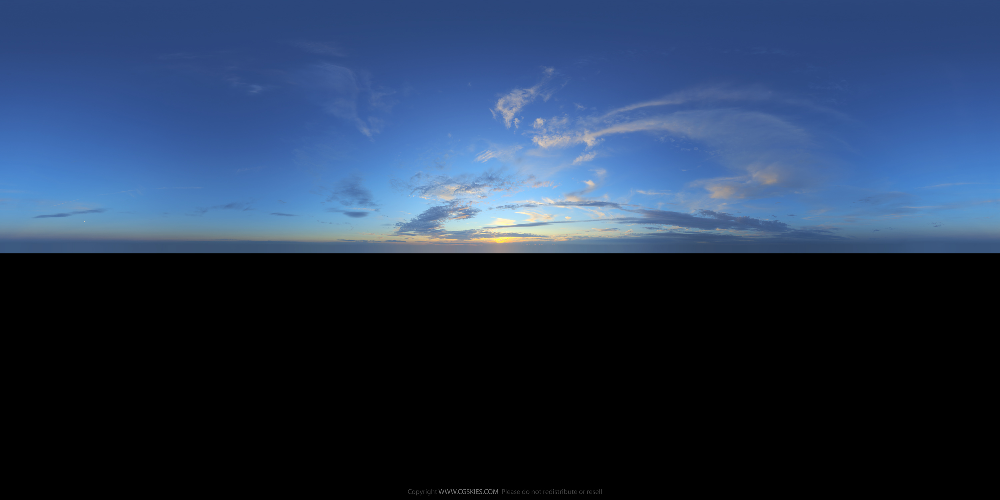

<a-scene inspector>

	<!-- Assets -->

	<a-assets>
		<a-asset-item id="Feisar-ship-obj" src="a-frame-assets/Feisar_Ship_OBJ/Feisar_Ship.obj"></a-asset-item>
		<a-asset-item id="Feisar-ship-mtl" src="a-frame-assets/Feisar_Ship_OBJ/Feisar_Ship.mtl"></a-asset-item>
		

		<!-- Sky is free sample sky from cgskies, buy one for commecial use -->
		
	</a-assets>

	<!-- CAMERA -->

	<a-entity look-at="#ship" ada-follow="target: #ship-camera-target;">
		<a-entity position="0 6 0" rotation="0 180 0">

			<!-- Disable the default wasd controls we are using those to control the ship -->
			<a-camera wasd-controls="enabled: false;"></a-camera>
		</a-entity>
	</a-entity>

	<!-- SHIP (from turbosquid) -->

	<a-entity ada-ship-controller="easing: 5; acceleration: 100;" rotation="0 90 0">
		<a-entity  id="ship-camera-target" position="0 0 15"></a-entity>

		<!-- The model was really big, and did not point in the direction I wanted. I also made it 1/20 it's original size so it is about 4 units wide. -->
		<a-obj-model src="#Feisar-ship-obj" mtl="#Feisar-ship-mtl" rotation="0 180 0" position="0 1 0" scale="0.05 0.05 0.05" id="ship"></a-obj-model>
	</a-entity>

	<!-- ENVIRONMENT -->

	<a-entity light="color: #FFFFFF; intensity: 0.3; type: ambient;"></a-entity>

	<!-- SKY SHADER -->
	<!--<a-ada-sky control="#sun" inclination="0.49">
		<a-entity light="color: #FFFFFF; intensity: 1.5" id="sun"></a-entity>
	</a-ada-sky>-->

	<!-- Prerendered for performance -->
	<a-sky src="#cgsky" position="0 -1 0" rotation="0 -90 0">
		<a-entity light="color: #FFFFFF; intensity: 1.5" position="0 1 50"></a-entity>
	</a-sky>

	<a-ada-ocean position="0 0 0" src="#water-normal" width="1000" depth="1000" light="#sun"></a-ada-ocean>

	<!-- TRACK -->

	<a-curve id="track" type="CatmullRom">
		<a-curve-point position="0 0 0"></a-curve-point>
		<a-curve-point position="1 0 0"></a-curve-point>
		<a-curve-point position="0 0 1"></a-curve-point>
	</a-curve>

	<a-draw-curve curve="#track" material="shader: line; color: red;"></a-draw-curve>
	<a-clone-along-curve geometry="primitive: box;" curve="#track" spacing="5"></a-clone-along-curve>

</a-scene>

