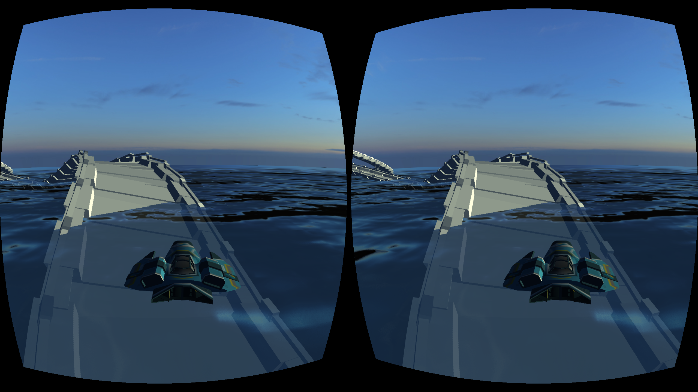
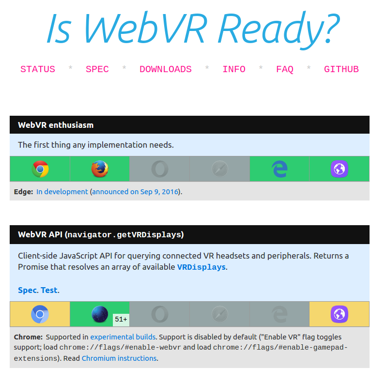
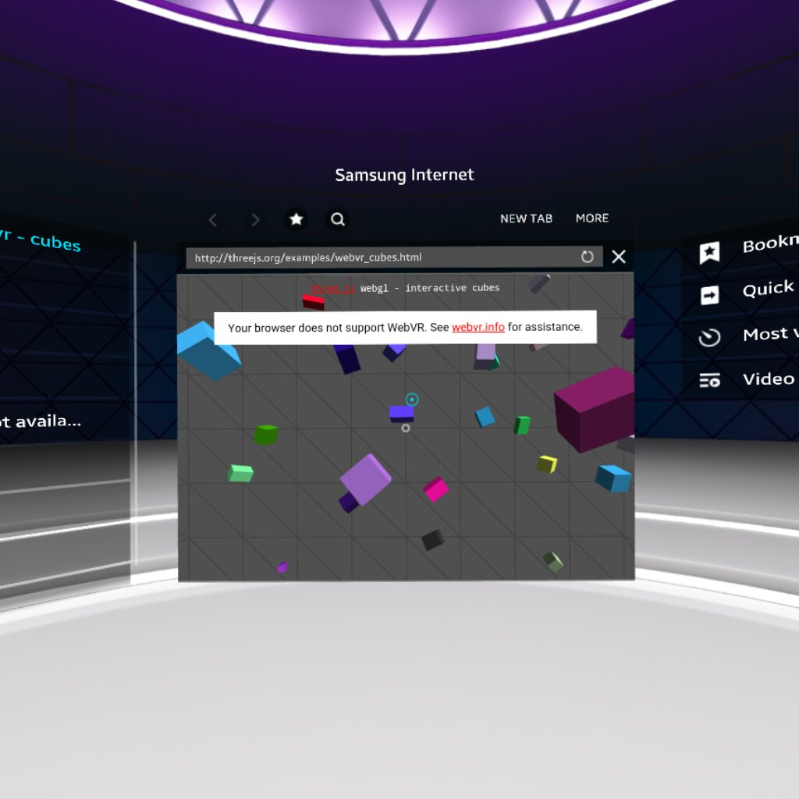
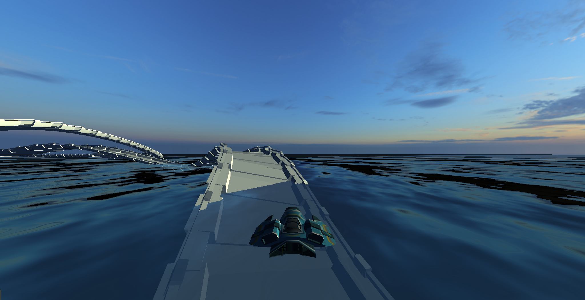
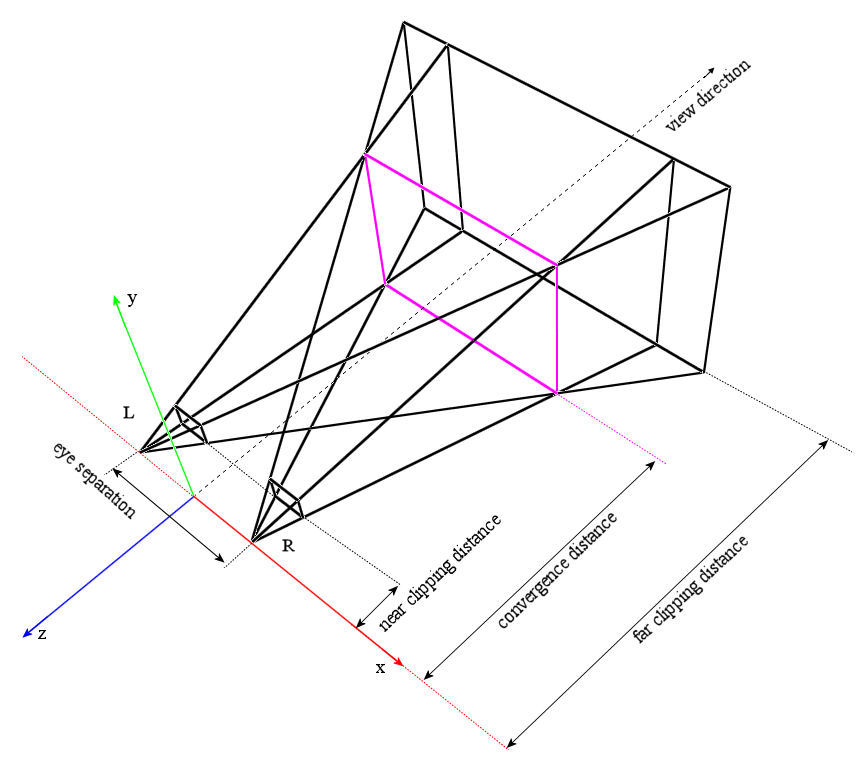

<!-- Define slide animation generators -->

<script>
	window.aSlidesSlideData = {};
</script>

<!-- contents -->

# Introducing the WebVR API

<!-- Link to trigger conversion script -->
[Convert to Slide Deck](#aslides)

<span id="a-frame-clock">30</span> Mins with 10 mins for questions at the end.

The goal of this talk is to be a technical introduction to the web's new virtual reality apis.

As a heads up this will be in depth and technical it will help if you have had experience with developing on the web and some experience with dealing with 3D rendering.

Fortunately the underlying concepts behind VR are not too onerous.

And the APIs handle a lot of the VR wrangling for you.

There are also many libraries and tools to handle 3D rendering in the web which I will introduce later.

*VR is pretty huge right now. Who here has used a VR headset of some kind?*

<!-- This slide uses information from _config.yml -->
<blockquote class="dark" id="splash-slide" style="background-image: url('images/pattern.svg');">
<h1>{{ site.name }}</h1>
<h3>{{ site.description }}</h3>
<h2>{{site.author.name}} - {{site.author.company}}</h2>
</blockquote>

## How does VR work?

Virtual reality headsets present sensory information to the user from a virtual envrionment. This technique relies on accurate head tracking. Requiring precise rotational detection and optionally positional detection.

Accurate simulation and tracking results in a feeling of immersion.

Primarily these headsets takes the form of a visual experience although 3D audio adds further immersion.

VR headsets acheive 3D by presenting each eye an image which has been rendered from it's equivalent point of view much as it is in real life.

The VR headsets usually consist of a high pixel density screen and two lenses to increase the field of view.

The high dpi screen shows two predistorted images. Distorted so that they squeeze in a greater field of view.

The lens then do the opposite transformation to make an undistorted image in the eye.

This seems like a lot of work and fortunately the WebVR APIs handle this for us so we can get focussed on the task of producing good content.

> 

## Contents

> * Where is it supported natively
> * The polyfill

## Where is it supported natively

> * Samsung Internet for Gear VR
>   * Enable on internet://webvr-enable
>   * Supports GearVR
> * Special Builds of Chrome
>   * Enable on chrome://flags
>   * Suports OpenVR (Vive) and Occulus Rift
> * Firefox
>   * Install webvr enabler addon to enable
>   * Suports Occulus Rift (OpenVR is experimental)

> 
>
> ## Turning on WebVR in the GearVR: `internet://webvr-enable`

> 
>
> ## https://iswebvrready.org

## From Web to VR introducing the new APIs.

## Setting the scene

Firstly we need to set up a 3D scene in the web.

There are many tools and libraries out there which render realtime 3D to a canvas using WebGL.

The latter of these spit out a precompiled web page so it is more difficult to get the WebVR scripting in but in theory it should apply.

THREE.js has examples included

> * Babylon.js
> * THREE.js
> * Unity (Builds for Web)
> * Unreal (Builds for Web)

> 
>
> http://threejs.org/examples/webvr_cubes.html

## High level overview

This scene is being rendered to a `<canvas>` element.

You will need to add a VR button to the scene as one can only present on a user interaction.

The WebVR APIs give you information about how you should render your scene.

Such as the position and rotation of TWO cameras one in the virtual position of where the user's eyes should be.

Each frame at the framerate of the headset you will need to render the scene from each eye

And submit the final composite image to headset

Note the final scene we submit does not have distortion applied

The headset will handle that.

<script>
window.aSlidesSlideData['slide-from-web-to-vr-introducing-the-new-apis-'] = window.contentSlide([
  {image: 'images/render1.png'},
  {image: 'images/render2.png'},
  {image: 'images/render3.png'}
]);
</script>

> 

## Some actual code

The most fundamental part of creating a virtual world is the display. The WebVR api provides information to suggest and guide how you should render your scene.

Getting a VR Display

`navigator.getVRDisplays` - returns a promise, resolves a list of `VRDisplay`s

These are the headsets that are attatched to the computer.

It provides apis to retrieve data on the headset such as field of view or the current position in space.

It also provides the ability to send images to the headset to be displayed to the user.

> ```js
navigator.getVRDisplays()
.then(displays => {
	if (displays.length > 0) {
		this.vrDisplay = displays[0];
	}
});
```

The WebVR Api is still under development so these may change.


requestPresent is a VR flavoured `Element.requestFullscreen()` it requests that the device goes fullscreen on that display without requiring user's permission although it can only be called on a user interaction such as a click.

You give it a canvas element and this is what is sent to the headset each frame.

**`VRDisplay.requestPresent({ source: myCanvas })`**


vrDisplay.requestAnimationFrame is a VR flavoured `requestAnimationFrame()` like the native equivalent it is called each time the display is ready to be updated. Although unlike the browser this display usually runs faster than 60hz, perhaps even 90hz or 120hz.

**`VRDisplay.requestAnimationFrame()`**


getEyeParameters gives you the information needed for setting up your stereoscopic camera's viewing frustrum.

**`VRDisplay.getEyeParameters()`**

>
> ## **`VRDisplay.requestPresent({ source: myCanvas })`**
>
> ## **`VRDisplay.requestAnimationFrame()`**
>
> ## **`VRDisplay.getEyeParameters()`**
>
> ## https://developer.mozilla.org/en-US/docs/Web/API/VRDisplay

## VREyeParameters

With all of the above information you can render a 3D video into the headset. Which will render accurately through the lenses.

- `VREyeParameters.offset`
  - Represents the offset from the center point between the user's eyes to the center of the eye, measured in meters.
- `VREyeParameters.fieldOfView`
  - Describes the current field of view for the eye, which can vary as the user adjusts their interpupillary distance (IPD).
- `VREyeParameters.renderWidth`
  - Describes the recommended render target width of each eye viewport, in pixels.
- `VREyeParameters.renderHeight`
  - Describes the recommended render target height of each eye viewport, in pixels.

> 

## Pose

**`VRDisplay.getPose()` or `VRDisplay.getImmediatePose()`**

Returns the pose i.e. the postion and rotation of the user's head, getPose applies some prediction for when the frame is actually rendered, getImmediatePose() is what the data is right now.

By combining this with the eyeParameters you can work out the position of each camera.

Should you choose not to use the eye offset parameter and show the same image to both eyes then the user will recieve no depth information.

Making the user feel like they are in a very large sphere.

It will not be 3D but can feel a tiny bit immersive as they are stil 'inside' the virtual experience.

I.e. Each camera is facing the same direction (like human eyes) and offset by a certain amount. In a position determined by the head location.

**`VRDisplay.submitFrame(pose)`**

This tells the VRDisplay to render what is on your canvas.

The pose in this case is the last pose from getPose() so even if your frame takes too long to render the browser can smooth out the motion by just reusing the previous image in the new position.

This makes the experience much more comfortable for the user.

https://developer.mozilla.org/en-US/docs/Web/API/VRDisplay

> ### Get the user's head position:
>
> `pose = VRDisplay.getPose()`
>
> ### Render you scene to the canvas:
>
> `myRenderFunction(pose);`
>
> ### Submit the rendered scene to the vr headet:
>
> `VRDisplay.submitFrame(pose)`
>

## Pose Video

<script>
window.aSlidesSlideData['slide-pose-video'] = window.playVideo;
</script>

> <video src="images/tracking.m4v" muted autoplay controls loop></video>
>
> ## `VRDisplay.getPose()`

## The polyfill

The polyfill allows phone browsers such as Android Chrome and iOS Safari to emulate the WebVR specs using a cardboard headset. So you can still produce experiences and ship them to a wide audience.

https://github.com/borismus/webvr-polyfill

It uses the Phone Browser's orientation API to work out the pose.

It derives the lens information from the specificaitons of the Google Cardboard and by looking up the specifications for the phone from a database.

> 
>
> ## https://github.com/borismus/webvr-polyfill

## Samsung Internet specific APIs

## Native Video Play Back

Play 3D or 360 videos natively for increased performance. By defining the type attribute.

>
> ## `<video controls src="360video.mp4" `**`type="video/mp4; dimension=360-lr;"`**`></video>`
>
> | Type Attribute  | Video Source                |
> |-----------------|-----------------------------|
> |dimension=3d-lr  | Side-by-Side 3D Video       |
> |dimension=3d-tb  | Top-to-bottom 3D Video      |
> |dimension=360    | 360˚ Video                  |
> |dimension=360-lr | Side-by-side 3D 360˚ Video  |
> |dimension=360-tb | Top-to-bottom 3D 360˚ Video |
> |dimension=180    | 180˚ Video                  |
> |dimension=180-lr | Side-by-side 3D 180˚ Video  |
> |dimension=180-tb | Top-to-bottom 3D 180˚ Video |
>
> ## http://developer.samsung.com/internet

This is the kind of video you can record with a Gear 360.

> 
>
> ## Still from a 360 video sphere.


## Set the skybox

The samsung browser has a skybox whilst the user is browsing.

The default is this kinda grey techno living room.

Probably not applicacble to everyone's site. But you can change it using a small bit of JavaScript.

<script>window.aSlidesSlideData['slide-set-the-skybox'] = window.playVideo;</script>

>
> ```javascript
window.SamsungChangeSky({ sphere: 'http://site.com/blue-sky.jpg' });
```
>
> <p><video src="images/vr-skybox.m4v" muted autoplay loop></video></p>
>
> ### https://output.jsbin.com/redobi/


We are planning to standardise these APIs at w3c.

Speaking of which:

There is a W3C workshop is to look at the intersection of Web and Virtual Reality ideas and technologies.

The workshop is to share the experiences of people working with Virtual Reality and the Web.

The goal is to encourage discussion about gaps in the Web Platform that may be holding back potential VR use cases.

Through this we will be exporing what standards are needed to make the web the de facto platform for web in the future.

If you would like to contribute go here

> ## https://www.w3.org/2016/06/vr-workshop/
>
> ## 19-20th October, San Jose CA. Registration closes on the 16th of September (be quick)

# A-Frame

The last thing I would like to introduce is A-Frame.

It sits above THREE.js and includes a polyfill to allow phones to behave like VR headsets.

It abstracts away the boilerplate of THREE.js to allow one ot start prototyping straight away.

A-Frame allows you to produce WebVR ready 3D scenes using HTML!!

> 

> ```html
	<html>
	<head>
		<script src="js/a-frame.js"></script>
	</head>
	<body>
		<a-scene>
			<a-sphere position="0 1.25 -1" radius="1.25" color="#EF2D5E"></a-sphere>
			<a-box position="-1 0.5 1" rotation="0 45 0" color="#4CC3D9"></a-box>
			<a-cylinder position="1 0.75 1" radius="0.5" color="#FFC65D"></a-cylinder>
			<a-plane rotation="-90 0 0" width="4" height="4" color="#7BC8A4"></a-plane>
			<a-sky color="#ECECEC"></a-sky>
		</a-scene>
	</body>
	</html>
```

## a-frame-example

<script>window.aSlidesSlideData['slide-a-frame-example'] = window.iframeSlide</script>

> <iframe src="https://ada.is/getting-started-with-webvr/basic.html" seamless="seamless"></iframe>
>
> ## https://ada.is/getting-started-with-webvr/basic.html

I will be talking all about A-Frame tomorrow at the same time.

With goal of getting everyone building something.

> 
>
> https://aframe.io

## Resources

> * https://developer.mozilla.org/en-US/docs/Web/API/WebVR_API
> * http://developer.samsung.com/internet
> * https://medium.com/samsung-internet-dev/control-the-world-with-the-skybox-api-6e8ca213f171
> * https://iswebvrready.org
> * https://github.com/gtk2k/Unity-WebVR-Assets?files=1
> * https://hacks.mozilla.org/2016/05/exporting-an-indie-unity-game-to-webvr/

<script>
	var iframes = Array.from(document.querySelectorAll('iframe'));
	var blank = 'about:blank';
	iframes.forEach(function (iframe) {
		var button = document.createElement('button');
		var src = iframe.src;
		iframe.src = blank;
		iframe.dataset.src = src;
		button.addEventListener('click', function () {
			iframe.src = iframe.src === blank ? src : blank;
			if (iframe.src === blank) {
				button.classList.add('blank');
				button.textContent = "Load iFrame";
			} else {
				button.classList.remove('blank');
				button.textContent = "Unload iFrame";
			}
		});
		button.classList.add('iframe-button');
		button.classList.add('blank');
		button.textContent = "Load iFrame";
		iframe.after(button);
	});
</script>
